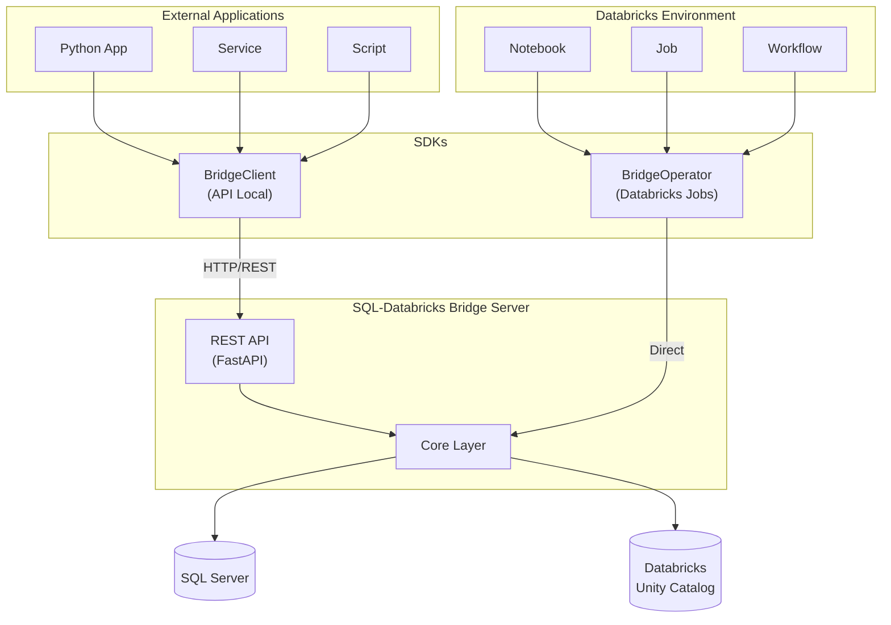

# SQL-Databricks Bridge

Bidirectional data synchronization service between SQL Server and Databricks.

## Features

- **SQL → Databricks Extraction**: CLI and REST API for extracting data from SQL Server and uploading to Databricks Volumes as Parquet files
- **Databricks → SQL Sync**: Event-driven synchronization with INSERT/UPDATE/DELETE support
- **Token-based Auth**: Per-table permissions with delete limits
- **Retry Logic**: Exponential backoff for transient failures
- **Audit Logging**: Security event tracking

## Quick Start

```bash
# Install
poetry install
cp .env.example .env
# Edit .env with your credentials

# Extract data
sql-databricks-bridge extract \
  --queries-path ./queries \
  --config-path ./config \
  --country Colombia \
  --destination /Volumes/catalog/schema/volume

# Start API server
sql-databricks-bridge serve
```

## CLI Commands

| Command | Description |
|---------|-------------|
| `extract` | Extract data from SQL Server to Databricks |
| `list-queries` | List available SQL query files |
| `show-params` | Show resolved parameters for a country |
| `test-connection` | Test SQL Server and Databricks connectivity |
| `serve` | Start the REST API server |
| `version` | Show version information |

## API Endpoints

| Method | Endpoint | Description |
|--------|----------|-------------|
| POST | `/extract` | Start extraction job |
| GET | `/jobs/{id}` | Get job status |
| GET | `/jobs` | List all jobs |
| DELETE | `/jobs/{id}` | Cancel job |
| GET | `/health/live` | Liveness probe |
| GET | `/health/ready` | Readiness probe |

## Configuration

### Environment Variables

```bash
# SQL Server
SQLSERVER_HOST=your-server.database.windows.net
SQLSERVER_DATABASE=your_database
SQLSERVER_USERNAME=your_user
SQLSERVER_PASSWORD=your_password

# Databricks
DATABRICKS_HOST=https://workspace.azuredatabricks.net
DATABRICKS_TOKEN=your_token
DATABRICKS_CATALOG=your_catalog
```

### Permissions (config/permissions.yaml)

```yaml
users:
  - token: "your-api-token"
    name: "your-project"
    permissions:
      - table: "dbo.YourTable"
        access: "read_write"
        max_delete_rows: 10000
```

## Databricks → SQL Sync

Insert events into `bridge.events.bridge_events`:

```sql
INSERT INTO bridge.events.bridge_events (
  event_id, operation, source_table, target_table, primary_keys
) VALUES (
  uuid(), 'INSERT', 'catalog.schema.source', 'dbo.target', array('id')
);
```

The poller processes events every 10 seconds.

## SDKs

The bridge provides two SDKs for different use cases:



### SDK: API Local (BridgeClient)

For external applications consuming the REST API:

```python
from sql_databricks_bridge.sdk import BridgeClient

# Initialize client
client = BridgeClient(
    base_url="http://localhost:8000",
    token="your-api-token"
)

# Extract data from SQL Server to Databricks
job = client.extract(
    queries_path="./queries",
    config_path="./config",
    country="Colombia",
    destination="/Volumes/catalog/schema/volume"
)

# Submit sync event (Databricks → SQL Server)
event = client.submit_sync_event(
    operation="INSERT",
    source_table="catalog.schema.source_table",
    target_table="dbo.target_table",
    primary_keys=["id"]
)
```

### SDK: Databricks Jobs (BridgeOperator)

For scripts running directly in Databricks notebooks/jobs:

```python
from sql_databricks_bridge.sdk.databricks import BridgeOperator

# Initialize operator (uses job context credentials)
operator = BridgeOperator(
    sql_server_host="server.database.windows.net",
    sql_server_database="KWP_Colombia",
    sql_server_user=dbutils.secrets.get("scope", "sql_user"),
    sql_server_password=dbutils.secrets.get("scope", "sql_pass")
)

# Sync from Databricks table to SQL Server
result = operator.sync_to_sql_server(
    source_table="catalog.schema.calibrated_panel",
    target_table="dbo.CalibrationResults",
    operation="INSERT",
    primary_keys=["id_hogar", "periodo"]
)

# Extract from SQL Server to Spark DataFrame
df = operator.extract_to_spark(
    query="SELECT * FROM dbo.Ventas WHERE fecha >= '2024-01-01'"
)
df.write.format("delta").saveAsTable("catalog.schema.ventas")
```

### SDK Comparison

| Feature | BridgeClient (API Local) | BridgeOperator (Databricks) |
|---------|--------------------------|----------------------------|
| **Use Case** | External apps, services | Notebooks, Jobs, Workflows |
| **Connection** | HTTP to REST API | Direct library usage |
| **Requires Server** | Yes | No |
| **Authentication** | API Token | SQL Server credentials |
| **Best For** | Automation, integrations | Data pipelines in Databricks |

### Installation

```bash
# From PyPI
pip install sql-databricks-bridge

# In Databricks job (requirements.txt)
sql-databricks-bridge>=1.0.0
```

## Development

```bash
# Install dev dependencies
poetry install

# Run all tests (uses mocks for SQL Server)
poetry run pytest

# Run only unit tests (no external connections needed)
poetry run pytest tests/unit/ -v

# Run Databricks integration tests (requires DATABRICKS_* env vars)
poetry run pytest tests/integration/test_databricks_only.py -v

# Type checking
poetry run mypy src/

# Linting
poetry run ruff check src/
```

### Testing with Databricks Only

If you only have Databricks access (no SQL Server), you can still run most tests:

```bash
# 1. Set your Databricks credentials
export DATABRICKS_HOST=https://your-workspace.azuredatabricks.net
export DATABRICKS_TOKEN=your_token

# Optional: for volume tests
export DATABRICKS_CATALOG=your_catalog
export DATABRICKS_SCHEMA=your_schema
export DATABRICKS_VOLUME=your_volume

# 2. Verify connection
python scripts/test_databricks_connection.py

# 3. Run tests (SQL Server is mocked)
poetry run pytest tests/ -v
```

The test suite uses mocks for SQL Server, so you can validate the extraction logic, sync operations, and Databricks file operations without SQL Server access.

## Documentation

- [Quick Start Guide](docs/QUICK_START.md)
- [Architecture](docs/ARCHITECTURE.md)
- [Epics and User Stories](docs/EPICS_AND_USER_STORIES.md)
- [Guía de Usuario (Español)](docs/GUIA_USUARIO.md) - Guía completa en español con ejemplos de configuración

## License

Proprietary - Kantar Worldpanel
