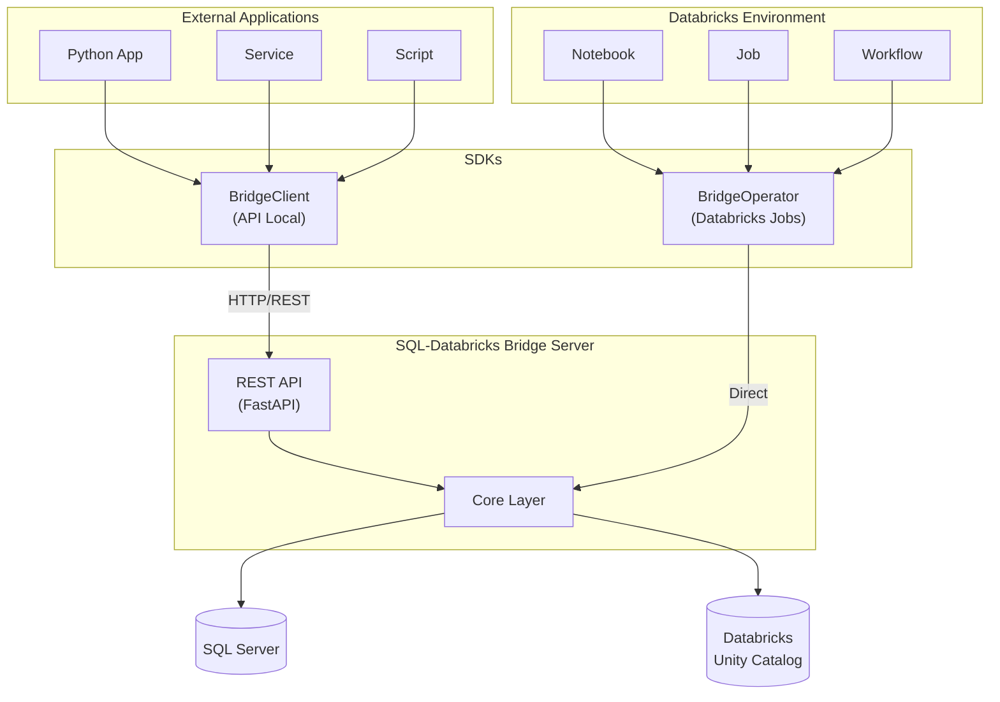

# SQL-Databricks Bridge

Bidirectional data synchronization service between SQL Server and Databricks.

---

## Context

In modern data architectures, organizations often need to maintain data across multiple platforms:

- **SQL Server**: Traditional OLTP databases for operational systems, legacy applications, and transactional workloads
- **Databricks**: Modern lakehouse platform for analytics, machine learning, and big data processing

This creates a common challenge: **how to keep data synchronized between these two worlds?**

## Problem

Data teams face several challenges when working with hybrid SQL Server + Databricks environments:

1. **Manual Data Transfers**: Teams resort to manual exports/imports, leading to errors and inconsistencies
2. **Lack of Automation**: No standardized way to schedule or trigger data movements
3. **Bi-directional Sync**: Most solutions only support one-way data flow
4. **Security Concerns**: Exposing database credentials across systems increases attack surface
5. **No Audit Trail**: Difficult to track what data was moved, when, and by whom
6. **Complex Setup**: Requires deep knowledge of both platforms to configure properly

## Solution

**SQL-Databricks Bridge** provides a unified service that solves these challenges:

- **Bi-directional Sync**: Extract from SQL Server → Databricks AND sync from Databricks → SQL Server
- **REST API + CLI**: Flexible interfaces for different use cases (automation, manual operations)
- **Event-Driven Architecture**: Databricks jobs can trigger SQL operations via an events table
- **Token-Based Security**: Per-table permissions with operation limits (e.g., max delete rows)
- **Comprehensive Audit Logging**: Track all operations for compliance and debugging
- **Python SDK**: Easy integration from Databricks notebooks and jobs

---

## Architecture Diagram

```
┌─────────────────────────────────────────────────────────────────────────────────────────┐
│                                    ARCHITECTURE                                          │
└─────────────────────────────────────────────────────────────────────────────────────────┘

┌─────────────────────┐                                           ┌─────────────────────┐
│                     │                                           │                     │
│    SQL SERVER       │                                           │     DATABRICKS      │
│                     │                                           │                     │
│  ┌───────────────┐  │                                           │  ┌───────────────┐  │
│  │  Operational  │  │                                           │  │   Volumes     │  │
│  │    Tables     │  │        SQL → Databricks                   │  │   (Parquet)   │  │
│  │               │  │  ◄──────────────────────────────────────► │  │               │  │
│  │  dbo.Sales    │  │        Extraction + Upload                │  │  /extract/    │  │
│  │  dbo.Products │  │                                           │  │    sales.pq   │  │
│  │  dbo.Customers│  │                                           │  │    prods.pq   │  │
│  └───────────────┘  │                                           │  └───────────────┘  │
│                     │                                           │                     │
│  ┌───────────────┐  │                                           │  ┌───────────────┐  │
│  │   Target      │  │        Databricks → SQL                   │  │   Events      │  │
│  │   Tables      │  │  ◄──────────────────────────────────────► │  │   Table       │  │
│  │               │  │        Event-Driven Sync                  │  │               │  │
│  │  dbo.Results  │  │        (INSERT/UPDATE/DELETE)             │  │ bridge_events │  │
│  └───────────────┘  │                                           │  └───────────────┘  │
│                     │                                           │                     │
└──────────┬──────────┘                                           └──────────┬──────────┘
           │                                                                  │
           │                                                                  │
           │              ┌───────────────────────────────────┐               │
           │              │                                   │               │
           │              │    SQL-DATABRICKS BRIDGE          │               │
           │              │         (Service)                 │               │
           │              │                                   │               │
           │              │  ┌─────────────────────────────┐  │               │
           └──────────────┤  │        REST API             │  ├───────────────┘
                          │  │  POST /extract              │  │
                          │  │  GET  /jobs/{id}            │  │
                          │  │  POST /sync                 │  │
                          │  │  GET  /health               │  │
                          │  └─────────────────────────────┘  │
                          │                                   │
                          │  ┌─────────────────────────────┐  │
                          │  │         CLI                 │  │
                          │  │  $ bridge extract           │  │
                          │  │  $ bridge serve             │  │
                          │  │  $ bridge test-connection   │  │
                          │  └─────────────────────────────┘  │
                          │                                   │
                          │  ┌─────────────────────────────┐  │
                          │  │     Event Poller            │  │
                          │  │  Monitors bridge_events     │  │
                          │  │  Executes sync operations   │  │
                          │  └─────────────────────────────┘  │
                          │                                   │
                          └───────────────────────────────────┘
                                           │
                                           │
              ┌────────────────────────────┴────────────────────────────┐
              │                                                         │
              ▼                                                         ▼
┌─────────────────────────────┐                       ┌─────────────────────────────┐
│                             │                       │                             │
│   Python SDK                │                       │   External Clients          │
│   (Databricks Jobs)         │                       │   (CI/CD, Airflow, etc)     │
│                             │                       │                             │
│  from sql_databricks_       │                       │  curl -X POST /extract      │
│    bridge_sdk import        │                       │    -H "Authorization: ..."  │
│    BridgeEventsClient       │                       │    -d '{"country": "CO"}'   │
│                             │                       │                             │
│  client = BridgeEvents...() │                       │                             │
│  client.create_insert_event │                       │                             │
│  client.wait_for_completion │                       │                             │
│                             │                       │                             │
└─────────────────────────────┘                       └─────────────────────────────┘
```

---

## Data Flow

### Flow 1: SQL Server → Databricks (Extraction)

```
SQL Server  ──(query)──►  Bridge  ──(parquet)──►  Databricks Volume
```

1. Client requests extraction via CLI or API
2. Bridge executes SQL queries with country-specific parameters
3. Results converted to Parquet using Polars
4. Files uploaded to Databricks Volumes via SDK

### Flow 2: Databricks → SQL Server (Event-Driven Sync)

```
Databricks Job  ──(insert event)──►  Events Table  ──(poll)──►  Bridge  ──(sync)──►  SQL Server
```

1. Databricks job inserts event into `bridge_events` table
2. Bridge poller detects new events
3. Bridge reads source data from Databricks
4. Bridge executes INSERT/UPDATE/DELETE on SQL Server

---

## Project Structure

```
sql-databricks-bridge/
├── src/
│   └── sql_databricks_bridge/          # Main application package
│       ├── api/                         # REST API layer
│       │   ├── routes/                  # API endpoints
│       │   │   ├── extract.py           # POST /extract
│       │   │   ├── jobs.py              # GET/DELETE /jobs
│       │   │   ├── sync.py              # POST /sync
│       │   │   └── health.py            # Health checks
│       │   ├── schemas.py               # Pydantic request/response models
│       │   └── dependencies.py          # FastAPI dependencies
│       │
│       ├── auth/                        # Authentication & Authorization
│       │   ├── token.py                 # Token validation
│       │   ├── permissions.py           # Permission checking
│       │   ├── loader.py                # Load permissions from YAML
│       │   └── audit.py                 # Security audit logging
│       │
│       ├── cli/                         # Command-Line Interface
│       │   └── commands.py              # Typer CLI commands
│       │
│       ├── core/                        # Core business logic
│       │   ├── config.py                # Configuration management
│       │   ├── extractor.py             # Data extraction logic
│       │   ├── param_resolver.py        # Country parameter resolution
│       │   ├── query_loader.py          # SQL file loading
│       │   └── uploader.py              # Databricks upload logic
│       │
│       ├── db/                          # Database clients
│       │   ├── sql_server.py            # SQL Server connection
│       │   └── databricks.py            # Databricks SDK wrapper
│       │
│       ├── sync/                        # Databricks → SQL sync
│       │   ├── poller.py                # Event table poller
│       │   ├── operations.py            # INSERT/UPDATE/DELETE ops
│       │   ├── validators.py            # Data validation
│       │   └── retry.py                 # Retry with backoff
│       │
│       ├── models/                      # Data models
│       │   └── events.py                # Event model definitions
│       │
│       ├── main.py                      # FastAPI application
│       ├── server.py                    # Standalone server (Nuitka)
│       └── __main__.py                  # CLI entry point
│
├── sdk/                                 # Python SDK for Databricks
│   └── sql_databricks_bridge_sdk/
│       ├── api_client.py                # REST API client
│       ├── events_client.py             # Events table client
│       ├── models.py                    # SDK data models
│       └── exceptions.py                # SDK exceptions
│
├── config/                              # Configuration files
│   └── permissions.yaml                 # Token permissions
│
├── queries/                             # SQL query templates
│   └── {country}/                       # Country-specific queries
│       └── *.sql
│
├── build/                               # Build scripts
│   ├── build_nuitka.py                  # Nuitka compilation
│   └── build.bat                        # Windows build script
│
├── scripts/                             # Utility scripts
│   ├── test_databricks_connection.py
│   ├── test_sql_connection.py
│   └── setup_databricks_tables.py
│
├── tests/                               # Test suite
│   ├── unit/                            # Unit tests (no external deps)
│   └── integration/                     # Integration tests
│
├── docs/                                # Documentation
│   ├── ARCHITECTURE.md
│   ├── BUILD_EXECUTABLE.md
│   ├── GUIA_USUARIO.md
│   └── SDK_USER_GUIDE.md
│
├── pyproject.toml                       # Poetry dependencies
├── .env.example                         # Environment template
└── README.md                            # This file
```

---

## Features

- **SQL → Databricks Extraction**: CLI and REST API for extracting data from SQL Server and uploading to Databricks Volumes as Parquet files
- **Databricks → SQL Sync**: Event-driven synchronization with INSERT/UPDATE/DELETE support
- **Token-based Auth**: Per-table permissions with delete limits
- **Retry Logic**: Exponential backoff for transient failures
- **Audit Logging**: Security event tracking

---

## Quick Start

```bash
# Install
poetry install
cp .env.example .env
# Edit .env with your credentials

# Extract data
sql-databricks-bridge extract \
  --queries-path ./queries \
  --config-path ./config \
  --country Colombia \
  --destination /Volumes/catalog/schema/volume

# Start API server
sql-databricks-bridge serve
```

## CLI Commands

| Command | Description |
|---------|-------------|
| `extract` | Extract data from SQL Server to Databricks |
| `list-queries` | List available SQL query files |
| `show-params` | Show resolved parameters for a country |
| `list-countries` | List available countries and their SQL Server configs |
| `test-connection` | Test SQL Server and Databricks connectivity |
| `serve` | Start the REST API server |
| `version` | Show version information |

## API Endpoints

| Method | Endpoint | Description |
|--------|----------|-------------|
| POST | `/extract` | Start extraction job |
| GET | `/jobs/{id}` | Get job status |
| GET | `/jobs` | List all jobs |
| DELETE | `/jobs/{id}` | Cancel job |
| GET | `/health/live` | Liveness probe |
| GET | `/health/ready` | Readiness probe |

## Configuration

### Multi-Country Support with kantar_db_handler

This bridge supports **multi-country deployments** where different countries use different SQL Server instances. This is achieved through integration with `kantar_db_handler`, which manages country-specific database configurations.

**How it works:**

1. Each country has a configuration file in `kantar_db_handler` (e.g., `Chile.json`, `Argentina.json`)
2. Each config specifies the SQL Server hostname and database for that country
3. When you make a request with a `country` parameter, the bridge automatically connects to the correct server

**Available countries:**
```bash
# List all configured countries and their servers
sql-databricks-bridge list-countries
```

**Example usage:**

```bash
# Extract data from Chile
sql-databricks-bridge extract \
  --country Chile \
  --queries-path ./queries \
  --config-path ./config \
  --destination /Volumes/catalog/schema/volume

# Extract data from Argentina (connects to different server automatically)
sql-databricks-bridge extract \
  --country Argentina \
  --queries-path ./queries \
  --config-path ./config \
  --destination /Volumes/catalog/schema/volume
```

**Installation:**

```bash
# kantar_db_handler should be in the same parent directory
pip install -e ../kantar_db_handler
```

**Fallback to manual configuration:**

If `kantar_db_handler` is not installed, the bridge uses the SQL Server settings from `.env` (single server only).

### Environment Variables

```bash
# SQL Server
SQLSERVER_HOST=your-server.database.windows.net
SQLSERVER_DATABASE=your_database
SQLSERVER_USERNAME=your_user
SQLSERVER_PASSWORD=your_password

# Databricks
DATABRICKS_HOST=https://workspace.azuredatabricks.net
DATABRICKS_TOKEN=your_token
DATABRICKS_CATALOG=your_catalog
```

### Permissions (config/permissions.yaml)

```yaml
users:
  - token: "your-api-token"
    name: "your-project"
    permissions:
      - table: "dbo.YourTable"
        access: "read_write"
        max_delete_rows: 10000
```

### Important Technical Notes

#### Catalog and Schema Names with Special Characters

When using Unity Catalog, catalog and schema names containing special characters (like hyphens) must be enclosed in backticks. The bridge automatically handles this for you:

```bash
# Correct - the bridge adds backticks internally
sql-databricks-bridge extract \
  --destination 002-mwp.bronze \
  --country Bolivia

# This creates tables in: `002-mwp`.`bronze`.`Bolivia_table_name`
```

**Why this matters:**
- Unity Catalog allows hyphens in names: `002-mwp`, `dev-workspace`, etc.
- SQL requires backticks for identifiers with special characters
- The bridge handles this automatically in table creation and staging paths

#### Windows Console Compatibility

The CLI has been optimized for Windows environments:

- **Unicode symbols removed**: Progress indicators use ASCII-compatible characters (OK, FAIL, ->)
- **Time-based progress**: Replaced Unicode spinner with elapsed time display
- **No encoding errors**: Works correctly in Windows Command Prompt and PowerShell

If you encounter encoding issues on other platforms, ensure your terminal supports UTF-8:
```bash
# Linux/macOS
export LANG=en_US.UTF-8

# Windows PowerShell
$OutputEncoding = [System.Text.Encoding]::UTF8
```

#### Stage-then-CTAS Pattern

The bridge uses a two-phase approach for creating Delta tables:

1. **Stage**: Upload Parquet file to `/Volumes/{catalog}/{schema}/{volume}/_staging/`
2. **CTAS**: Execute `CREATE OR REPLACE TABLE ... AS SELECT * FROM read_files()`
3. **Cleanup**: Delete temporary staging file

**Benefits:**
- Atomic table replacements (no intermediate states)
- Automatic schema inference from Parquet
- Unity Catalog integration
- Clean storage (no leftover staging files)

The staging path automatically uses the same catalog/schema as the target table, ensuring proper namespace alignment.

## Databricks → SQL Sync

Insert events into `bridge.events.bridge_events`:

```sql
INSERT INTO bridge.events.bridge_events (
  event_id, operation, source_table, target_table, primary_keys
) VALUES (
  uuid(), 'INSERT', 'catalog.schema.source', 'dbo.target', array('id')
);
```

The poller processes events every 10 seconds.

## SDKs

The bridge provides two SDKs for different use cases:



### SDK: API Local (BridgeClient)

For external applications consuming the REST API:

```python
from sql_databricks_bridge.sdk import BridgeClient

# Initialize client
client = BridgeClient(
    base_url="http://localhost:8000",
    token="your-api-token"
)

# Extract data from SQL Server to Databricks
job = client.extract(
    queries_path="./queries",
    config_path="./config",
    country="Colombia",
    destination="/Volumes/catalog/schema/volume"
)

# Submit sync event (Databricks → SQL Server)
event = client.submit_sync_event(
    operation="INSERT",
    source_table="catalog.schema.source_table",
    target_table="dbo.target_table",
    primary_keys=["id"]
)
```

### SDK: Databricks Jobs (BridgeOperator)

For scripts running directly in Databricks notebooks/jobs:

```python
from sql_databricks_bridge.sdk.databricks import BridgeOperator

# Initialize operator (uses job context credentials)
operator = BridgeOperator(
    sql_server_host="server.database.windows.net",
    sql_server_database="KWP_Colombia",
    sql_server_user=dbutils.secrets.get("scope", "sql_user"),
    sql_server_password=dbutils.secrets.get("scope", "sql_pass")
)

# Sync from Databricks table to SQL Server
result = operator.sync_to_sql_server(
    source_table="catalog.schema.calibrated_panel",
    target_table="dbo.CalibrationResults",
    operation="INSERT",
    primary_keys=["id_hogar", "periodo"]
)

# Extract from SQL Server to Spark DataFrame
df = operator.extract_to_spark(
    query="SELECT * FROM dbo.Ventas WHERE fecha >= '2024-01-01'"
)
df.write.format("delta").saveAsTable("catalog.schema.ventas")
```

### SDK Comparison

| Feature | BridgeClient (API Local) | BridgeOperator (Databricks) |
|---------|--------------------------|----------------------------|
| **Use Case** | External apps, services | Notebooks, Jobs, Workflows |
| **Connection** | HTTP to REST API | Direct library usage |
| **Requires Server** | Yes | No |
| **Authentication** | API Token | SQL Server credentials |
| **Best For** | Automation, integrations | Data pipelines in Databricks |

### Installation

```bash
# From PyPI
pip install sql-databricks-bridge

# In Databricks job (requirements.txt)
sql-databricks-bridge>=1.0.0
```

## Development

```bash
# Install dev dependencies
poetry install

# Run all tests (uses mocks for SQL Server)
poetry run pytest

# Run only unit tests (no external connections needed)
poetry run pytest tests/unit/ -v

# Run Databricks integration tests (requires DATABRICKS_* env vars)
poetry run pytest tests/integration/test_databricks_only.py -v

# Type checking
poetry run mypy src/

# Linting
poetry run ruff check src/
```

### Testing with Databricks Only

If you only have Databricks access (no SQL Server), you can still run most tests:

```bash
# 1. Set your Databricks credentials
export DATABRICKS_HOST=https://your-workspace.azuredatabricks.net
export DATABRICKS_TOKEN=your_token

# Optional: for volume tests
export DATABRICKS_CATALOG=your_catalog
export DATABRICKS_SCHEMA=your_schema
export DATABRICKS_VOLUME=your_volume

# 2. Verify connection
python scripts/test_databricks_connection.py

# 3. Run tests (SQL Server is mocked)
poetry run pytest tests/ -v
```

The test suite uses mocks for SQL Server, so you can validate the extraction logic, sync operations, and Databricks file operations without SQL Server access.

## Python SDK

The SDK provides easy-to-use clients for interacting with the bridge service:

```python
# In Databricks notebooks/jobs
from sql_databricks_bridge_sdk import BridgeEventsClient

client = BridgeEventsClient()
event_id = client.create_insert_event(
    source_table="catalog.schema.source",
    target_table="dbo.Target",
    primary_keys=["id"]
)
result = client.wait_for_completion(event_id)
```

See [SDK README](sdk/README.md) for installation and usage details.

## Building Executable

To compile as a standalone executable for server deployment:

```bash
# Install build dependencies
poetry install --with build

# Build both CLI and server executables
python build/build_nuitka.py

# Build single-file executable
python build/build_nuitka.py --onefile
```

See [Build Documentation](docs/BUILD_EXECUTABLE.md) for detailed instructions.

## Documentation

- [Quick Start Guide](docs/QUICK_START.md)
- [Architecture](docs/ARCHITECTURE.md)
- [Epics and User Stories](docs/EPICS_AND_USER_STORIES.md)
- [Guía de Usuario (Español)](docs/GUIA_USUARIO.md) - Guía completa en español con ejemplos de configuración
- [Guía de Sincronización Databricks → SQL](docs/GUIA_SINCRONIZACION_DATABRICKS_SQL.md) - Cómo usar la tabla de eventos desde jobs de Databricks
- [SDK User Guide (Español)](docs/SDK_USER_GUIDE.md) - Guía completa del SDK de Python
- [Build Executable](docs/BUILD_EXECUTABLE.md) - Compilar ejecutable con Nuitka

## License

Proprietary - Kantar Worldpanel
