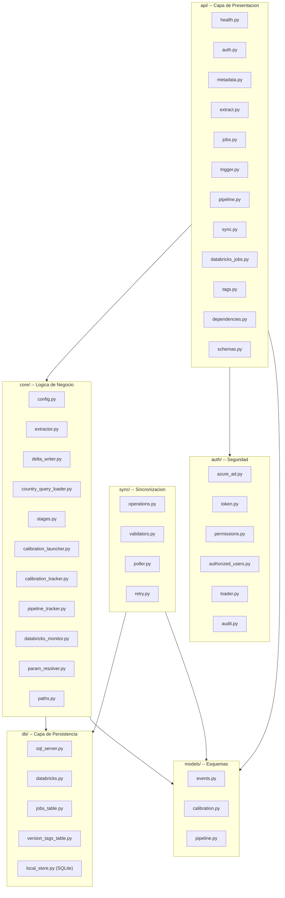
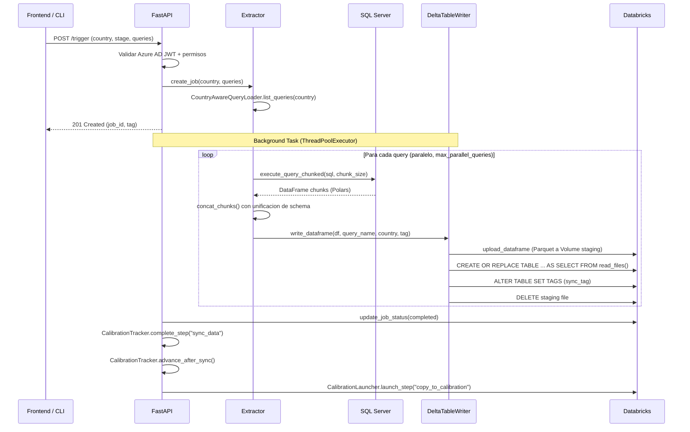
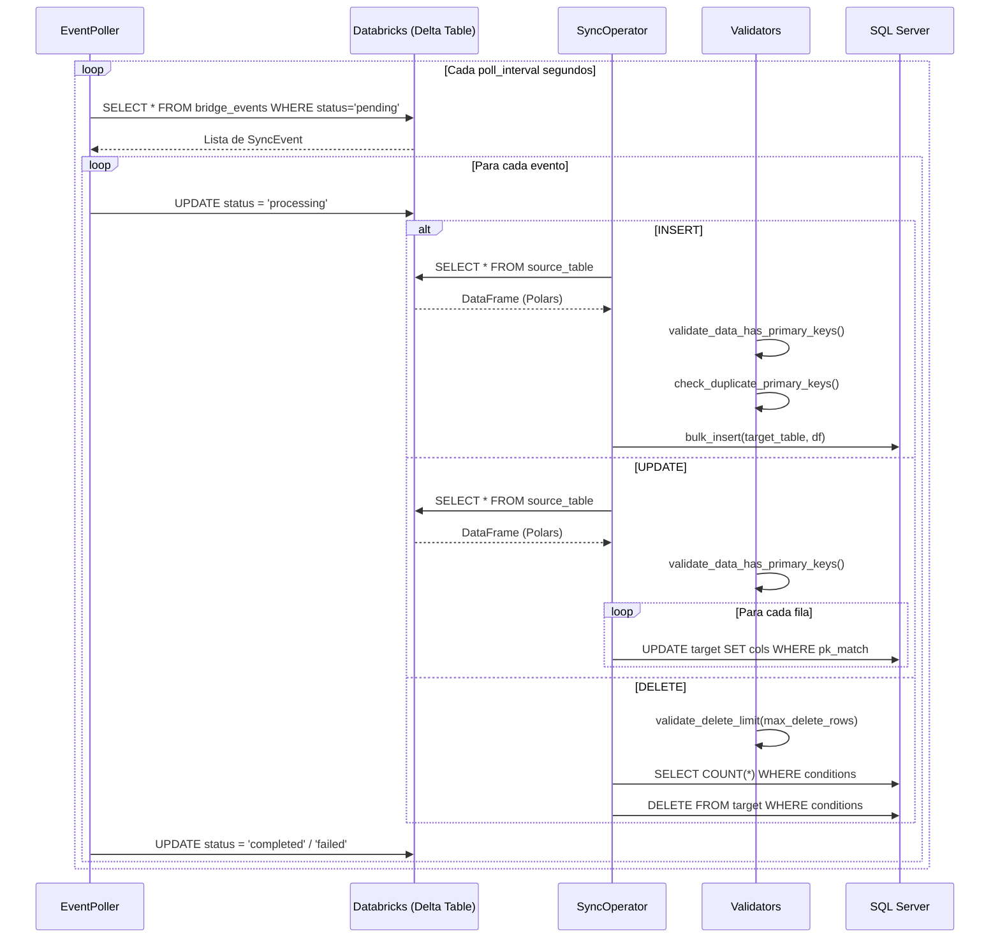
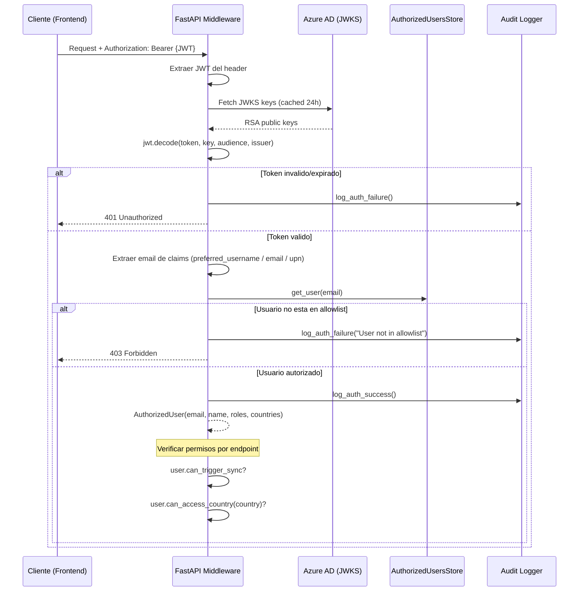
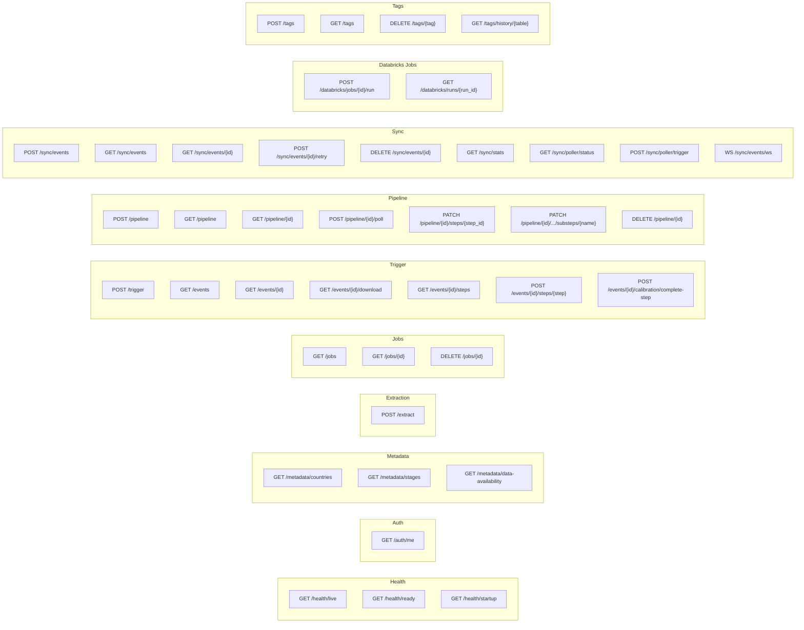
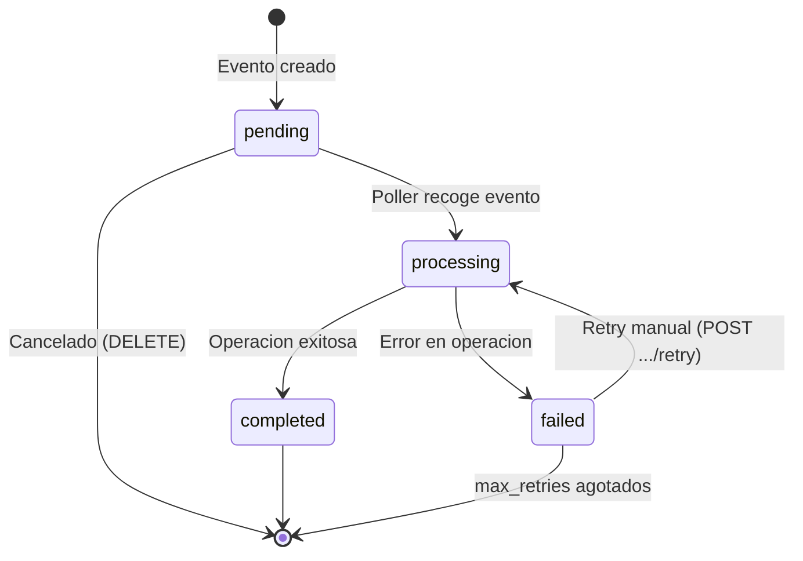
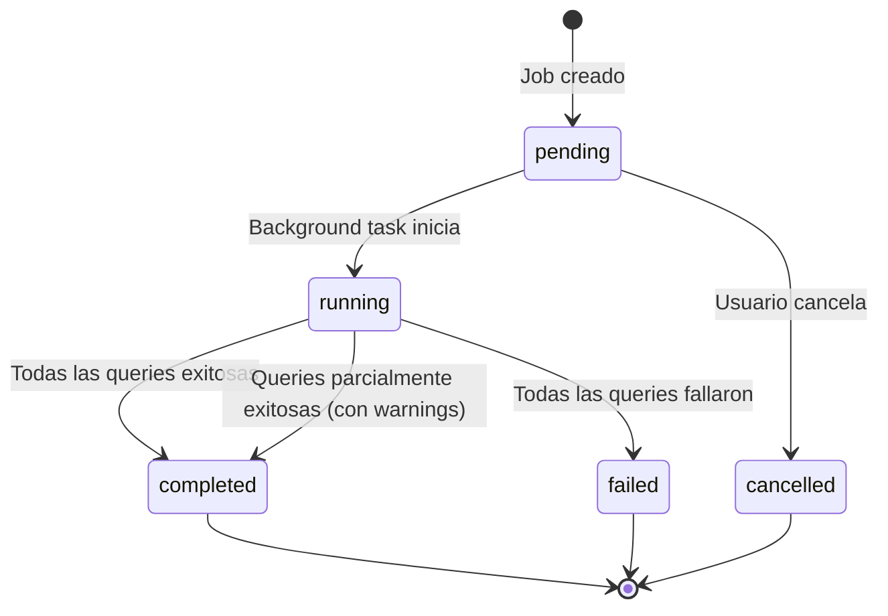
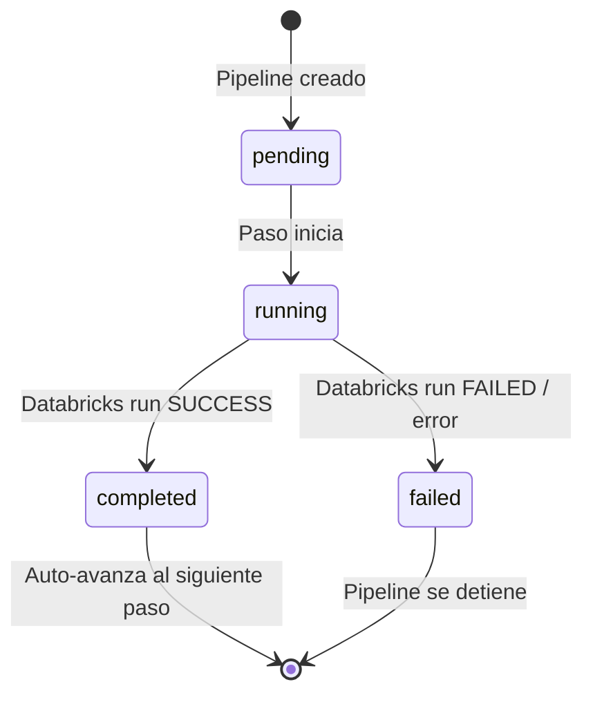

# SQL-Databricks Bridge -- Documentacion Backend

**Servicio**: sql-databricks-bridge v0.1.14
**Equipo**: Technology Solutions LATAM -- Numerator / Kantar
**Fecha**: Febrero 2026

---

## Tabla de Contenidos

- [1. Resumen Ejecutivo](#1-resumen-ejecutivo)
- [2. Stack Tecnologico](#2-stack-tecnologico)
- [3. Arquitectura de Modulos](#3-arquitectura-de-modulos)
- [4. Flujo de Datos](#4-flujo-de-datos)
  - [4.1. Extraccion: SQL Server a Databricks](#41-extraccion-sql-server-a-databricks)
  - [4.2. Sincronizacion: Databricks a SQL Server](#42-sincronizacion-databricks-a-sql-server)
  - [4.3. Pipeline de Calibracion](#43-pipeline-de-calibracion)
- [5. Sistema de Autenticacion](#5-sistema-de-autenticacion)
- [6. Referencia Completa de API](#6-referencia-completa-de-api)
  - [6.1. Health](#61-health)
  - [6.2. Auth](#62-auth)
  - [6.3. Metadata](#63-metadata)
  - [6.4. Extraction](#64-extraction)
  - [6.5. Jobs](#65-jobs)
  - [6.6. Trigger](#66-trigger)
  - [6.7. Pipeline](#67-pipeline)
  - [6.8. Sync](#68-sync)
  - [6.9. Databricks Jobs](#69-databricks-jobs)
  - [6.10. Tags](#610-tags)
- [7. Modelos de Datos](#7-modelos-de-datos)
  - [7.1. SyncEvent](#71-syncevent)
  - [7.2. CalibrationStep](#72-calibrationstep)
  - [7.3. PipelineStep y CalibrationPipeline](#73-pipelinestep-y-calibrationpipeline)
  - [7.4. ExtractionJob](#74-extractionjob)
- [8. Ciclo de Vida de Eventos](#8-ciclo-de-vida-de-eventos)
- [9. Componentes Core](#9-componentes-core)
  - [9.1. Extractor](#91-extractor)
  - [9.2. DeltaTableWriter](#92-deltatablewriter)
  - [9.3. SyncOperator](#93-syncoperator)
  - [9.4. CalibrationLauncher](#94-calibrationlauncher)
  - [9.5. CalibrationTracker](#95-calibrationtracker)
  - [9.6. DatabricksJobMonitor](#96-databricksjobmonitor)
  - [9.7. EventPoller](#97-eventpoller)
- [10. Conexiones a Base de Datos](#10-conexiones-a-base-de-datos)
- [11. Configuracion](#11-configuracion)
- [12. CLI](#12-cli)
- [13. Lifespan del Servicio](#13-lifespan-del-servicio)
- [14. Compilacion y Distribucion](#14-compilacion-y-distribucion)
- [15. Ejecucion de Tests](#15-ejecucion-de-tests)

---

## 1. Resumen Ejecutivo

**SQL-Databricks Bridge** es un servicio backend que proporciona sincronizacion bidireccional de datos entre SQL Server on-premise y Databricks Unity Catalog. El servicio expone una API REST con autenticacion Azure AD, orquesta pipelines de calibracion multi-paso sobre Databricks Asset Bundles, y ofrece actualizaciones en tiempo real via WebSocket. Esta disenado para ser consumido por una **aplicacion de escritorio Tauri** (ver [documentacion frontend](frontend-documentation.md)) utilizada por ingenieros de datos y analistas de Numerator/Kantar WorldPanel LATAM.

El servicio resuelve tres necesidades operativas criticas:

1. **Extraccion de datos** (SQL Server -> Databricks): Transfiere tablas desde servidores SQL Server distribuidos por pais hacia tablas Delta en Unity Catalog, con ejecucion paralela de queries, chunking configurable y versionamiento automatico.

2. **Sincronizacion inversa** (Databricks -> SQL Server): Permite operaciones INSERT, UPDATE y DELETE desde tablas Delta hacia SQL Server, con validacion de primary keys, limites de seguridad para DELETE y retry con backoff exponencial.

3. **Orquestacion de calibracion**: Coordina un pipeline de 6 pasos (sync_data, copy_to_calibration, merge_data, simulate_kpis, calculate_penetration, download_csv) que ejecuta jobs en Databricks Asset Bundles y reporta progreso en tiempo real al frontend.

El sistema esta disenado para operar como un ejecutable standalone compilado con Nuitka, desplegable en servidores Windows de la red corporativa sin necesidad de instalar Python.

---

## 2. Stack Tecnologico

| Componente | Tecnologia | Version | Proposito |
|-----------|------------|---------|-----------|
| Runtime | Python | ^3.11 | Lenguaje base |
| Framework Web | FastAPI | ^0.109.0 | API REST + WebSocket |
| ASGI Server | Uvicorn | ^0.27.0 | Servidor HTTP async |
| ORM / SQL | SQLAlchemy | ^2.0.25 | Conexion SQL Server |
| ODBC Driver | pyodbc | ^5.1.0 | Driver ODBC para SQL Server |
| DataFrames | Polars | ^1.0.0 | Procesamiento de datos columnar |
| Arrow IPC | PyArrow | ^15.0.0 | Serializacion Parquet / interop |
| Databricks SDK | databricks-sdk | ^0.74.0 | Unity Catalog, Jobs API, Volumes |
| JWT Auth | PyJWT[crypto] | ^2.8.0 | Validacion de tokens Azure AD |
| HTTP Client | httpx | ^0.27.0 | Llamadas a JWKS endpoint |
| CLI | Typer | ^0.12.0 | Interfaz de linea de comandos |
| Rich Output | Rich | ^13.7.0 | Tablas y progreso en terminal |
| Config | pydantic-settings | ^2.1.0 | Configuracion desde .env |
| YAML | PyYAML | ^6.0.1 | Archivos de configuracion |
| File Watch | watchfiles | ^0.21.0 | Hot-reload de permisos |
| Compilacion | Nuitka | ^2.0.0 | Compilacion a binario standalone |
| Build System | Poetry | - | Gestion de dependencias |
| Testing | pytest + pytest-asyncio | ^8.0.0 | Tests unitarios y async |
| Linter | Ruff | ^0.2.0 | Linting y formateo |
| Type Check | mypy | ^1.8.0 | Verificacion de tipos |

---

## 3. Arquitectura de Modulos



La arquitectura sigue un patron de capas con separacion clara de responsabilidades:

- **api/**: Endpoints FastAPI, schemas de request/response, dependencias de autenticacion.
- **core/**: Logica de negocio: extraccion, escritura Delta, carga de queries, orquestacion de calibracion, monitoreo de jobs.
- **db/**: Clientes de base de datos (SQL Server via pyodbc/SQLAlchemy, Databricks via SDK, SQLite para persistencia local).
- **sync/**: Operaciones de sincronizacion inversa (Databricks -> SQL Server), validadores, poller de eventos, logica de reintentos.
- **auth/**: Validacion JWT Azure AD, allowlist de usuarios autorizados, permisos por tabla, audit logging.
- **models/**: Modelos Pydantic compartidos entre capas (SyncEvent, CalibrationStep, PipelineStep).

---

## 4. Flujo de Datos

### 4.1. Extraccion: SQL Server a Databricks



**Detalles del flujo de extraccion:**

1. El frontend envia un POST a `/trigger` con pais, stage y queries opcionales.
2. Se valida el token JWT contra Azure AD y se verifica que el usuario tenga permisos para el pais solicitado.
3. Se crea un `ExtractionJob` y se persiste en la tabla Delta `bridge.events.trigger_jobs` y en SQLite local.
4. Las queries se ejecutan en paralelo usando `ThreadPoolExecutor` (configurable con `max_parallel_queries`, default 4).
5. Cada query lee de SQL Server en chunks de `extraction_chunk_size` filas (default 100,000) y concatena los resultados con unificacion de schema (manejo de columnas Null type).
6. Los DataFrames se escriben a tablas Delta usando el patron **stage-then-CTAS**: upload Parquet a Volume staging, luego `CREATE OR REPLACE TABLE ... AS SELECT * FROM read_files(...)`.
7. Al completar la extraccion, se avanza automaticamente al siguiente paso de calibracion.

### 4.2. Sincronizacion: Databricks a SQL Server



**Detalles de la sincronizacion:**

- El `EventPoller` ejecuta un ciclo de polling cada `polling_interval_seconds` (default 10s).
- Lee eventos pendientes de la tabla Delta `bridge.events.bridge_events`, ordenados por prioridad DESC y fecha ASC.
- Cada operacion tiene validaciones estrictas: PKs requeridos para UPDATE/DELETE, limite maximo de filas para DELETE (default 10,000), verificacion de duplicados en PKs.
- Los reintentos usan backoff exponencial (3 intentos, delay base 1s, delay maximo 30s).

### 4.3. Pipeline de Calibracion

```mermaid
flowchart LR
    S1["1. sync_data<br/>(SQL Server -> Databricks)"]
    S2["2. copy_to_calibration<br/>(Bronze Copy job)"]
    S3["3. merge_data<br/>(Country Penetration job)"]
    S4["4. simulate_kpis<br/>(cubierto por merge_data)"]
    S5["5. calculate_penetration<br/>(cubierto por merge_data)"]
    S6["6. download_csv<br/>(auto-complete)"]

    S1 -->|completado| S2
    S2 -->|Databricks job completado| S3
    S3 -->|un solo job cubre 3 pasos| S4
    S4 --> S5
    S5 -->|completado| S6

    style S1 fill:#4CAF50,color:#fff
    style S2 fill:#2196F3,color:#fff
    style S3 fill:#FF9800,color:#fff
    style S4 fill:#FF9800,color:#fff
    style S5 fill:#FF9800,color:#fff
    style S6 fill:#9C27B0,color:#fff
```



**Pasos del pipeline de calibracion:**

| Paso | Nombre | Job Databricks | Descripcion |
|------|--------|----------------|-------------|
| 1 | `sync_data` | (interno) | Extraccion SQL Server -> tablas Delta en `000-sql-databricks-bridge.{country}` |
| 2 | `copy_to_calibration` | Bronze Copy | Copia tablas desde `000-sql-databricks-bridge` a `001-calibration-3-0.bronze-{country}` |
| 3 | `merge_data` | {Country} Penetration Calibration | Merge a capa silver, simulacion de KPIs y calculo de penetracion |
| 4 | `simulate_kpis` | (cubierto por paso 3) | Simulacion de KPIs -- ejecutado por el mismo job del paso 3 |
| 5 | `calculate_penetration` | (cubierto por paso 3) | Calculo de penetracion -- ejecutado por el mismo job del paso 3 |
| 6 | `download_csv` | (auto-complete) | Disponibilidad del CSV de resultados |

El `CalibrationLauncher` mapea pasos a jobs de Databricks Asset Bundles. Un solo job puede cubrir multiples pasos (por ejemplo, el job "Bolivia Penetration Calibration" cubre merge_data, simulate_kpis y calculate_penetration). El `DatabricksJobMonitor` realiza polling periodico del estado de los runs y auto-avanza al siguiente paso cuando el run termina.

---

## 5. Sistema de Autenticacion



**Componentes del sistema de autenticacion:**

1. **AzureADTokenValidator** (`auth/azure_ad.py`): Valida tokens JWT contra las claves JWKS de Azure AD. Verifica firma RS256, audience (client_id de la app), issuer (tenant), y expiracion. Las claves JWKS se cachean por 24 horas con rotacion automatica.

2. **AuthorizedUsersStore** (`auth/authorized_users.py`): Carga un allowlist desde `authorized_users.yaml` con la estructura:
   ```yaml
   users:
     - email: "usuario@company.com"
       name: "Nombre Completo"
       roles: ["admin"]          # admin | operator | analyst | viewer
       countries: ["*"]          # "*" = todos, o lista especifica
   ```

3. **Roles y permisos:**

   | Rol | can_trigger_sync | can_access_country | is_admin |
   |-----|-----------------|-------------------|----------|
   | admin | Si | Todos | Si |
   | operator | Si | Segun countries[] | No |
   | analyst | Si | Segun countries[] | No |
   | viewer | No | Segun countries[] | No |

4. **PermissionManager** (legacy, `auth/permissions.py`): Sistema basado en tokens estaticos para acceso por tabla. Se usa en endpoints de extraccion directa (`/extract`). El sistema Azure AD es el metodo primario para el frontend.

5. **Audit Logging** (`auth/audit.py`): Registra todos los intentos de autenticacion (exitosos y fallidos) con IP del cliente, email del usuario y razon del fallo.

---

## 6. Referencia Completa de API

Todos los endpoints estan bajo el prefijo `/api/v1`. La documentacion interactiva esta disponible en `/docs` (Swagger UI).



### 6.1. Health

#### `GET /health/live`

Probe de liveness para Kubernetes. Confirma que el servicio esta ejecutandose.

**Response** `200 OK`:
```json
{"status": "ok"}
```

#### `GET /health/ready`

Probe de readiness. Verifica conectividad con SQL Server y Databricks.

**Response** `200 OK`:
```json
{
  "status": "healthy",
  "version": "0.1.14",
  "environment": "production",
  "components": {
    "sql_server": {
      "status": "healthy",
      "message": "Connected",
      "details": {"host": "sql-server-host", "database": "master"}
    },
    "databricks": {
      "status": "healthy",
      "message": "Connected",
      "details": {"host": "adb-xxx.azuredatabricks.net", "catalog": "main"}
    }
  }
}
```

#### `GET /health/startup`

Probe de startup para Kubernetes.

**Response** `200 OK`:
```json
{"status": "started"}
```

---

### 6.2. Auth

#### `GET /auth/me`

Retorna la identidad del usuario autenticado, sus roles y paises autorizados.

**Headers**: `Authorization: Bearer {Azure AD JWT}`

**Response** `200 OK`:
```json
{
  "email": "usuario@company.com",
  "name": "Nombre Completo",
  "roles": ["admin"],
  "countries": ["*"]
}
```

**Errores**: `401` si el token es invalido o expirado, `403` si el usuario no esta en el allowlist.

---

### 6.3. Metadata

#### `GET /metadata/countries`

Lista los paises disponibles con sus queries SQL configuradas. La carga de queries se ejecuta en paralelo para evitar bloqueos por timeouts de red.

**Response** `200 OK`:
```json
{
  "countries": [
    {
      "code": "bolivia",
      "queries": ["j_atoscompra_new", "hato_cabecalho", "cl_catproduto_new"],
      "queries_count": 3,
      "type": "country"
    },
    {
      "code": "reporting-server",
      "queries": ["dim_products"],
      "queries_count": 1,
      "type": "server"
    }
  ]
}
```

#### `GET /metadata/stages`

Lista las etapas de pipeline configuradas desde `stages.yaml`.

**Response** `200 OK`:
```json
{
  "stages": [
    {"code": "calibracion", "name": "Calibracion de Panel"},
    {"code": "mtr", "name": "Market Tracking Report"}
  ]
}
```

#### `GET /metadata/data-availability`

Verifica disponibilidad de datos de elegibilidad y pesaje en SQL Server para un periodo dado. Ejecuta consultas en paralelo por pais.

**Query Parameters**: `period` (string, formato YYYYMM, requerido)

**Response** `200 OK`:
```json
{
  "period": "202602",
  "countries": {
    "bolivia": {"elegibilidad": true, "pesaje": true},
    "chile": {"elegibilidad": true, "pesaje": false}
  }
}
```

---

### 6.4. Extraction

#### `POST /extract`

Inicia un job de extraccion directa (sin autenticacion Azure AD, usa token-based auth legacy).

**Request Body**:
```json
{
  "queries_path": "/path/to/queries",
  "config_path": "/path/to/config",
  "country": "bolivia",
  "destination": null,
  "target_catalog": "kpi_dev_01",
  "target_schema": "bronze",
  "queries": ["j_atoscompra_new"],
  "overwrite": false,
  "chunk_size": 100000
}
```

**Response** `202 Accepted`:
```json
{
  "job_id": "uuid-string",
  "status": "pending",
  "message": "Extraction job started",
  "queries_count": 1
}
```

---

### 6.5. Jobs

#### `GET /jobs`

Lista todos los jobs de extraccion en memoria.

**Query Parameters**: `status_filter` (opcional), `limit` (default 100)

**Response** `200 OK`: Lista de `JobStatusResponse`.

#### `GET /jobs/{job_id}`

Obtiene el estado detallado de un job de extraccion.

**Response** `200 OK`:
```json
{
  "job_id": "uuid",
  "status": "completed",
  "country": "bolivia",
  "destination": "",
  "created_at": "2026-02-18T10:00:00",
  "started_at": "2026-02-18T10:00:01",
  "completed_at": "2026-02-18T10:05:30",
  "queries_total": 5,
  "queries_completed": 5,
  "queries_failed": 0,
  "results": [
    {
      "query_name": "j_atoscompra_new",
      "status": "completed",
      "rows_extracted": 250000,
      "table_name": "`main`.`bolivia`.`j_atoscompra_new`",
      "duration_seconds": 45.2,
      "error": null
    }
  ],
  "error": null
}
```

#### `DELETE /jobs/{job_id}`

Cancela un job de extraccion en ejecucion.

**Response** `204 No Content`

---

### 6.6. Trigger

#### `POST /trigger`

Endpoint principal del frontend. Dispara una extraccion autenticada con Azure AD, crea tracking de calibracion e inicia el pipeline automatico.

**Headers**: `Authorization: Bearer {Azure AD JWT}`

**Request Body**:
```json
{
  "country": "bolivia",
  "stage": "calibracion",
  "period": "202602",
  "queries": null,
  "aggregations": {
    "region": false,
    "nivel_2": false
  },
  "row_limit": null,
  "lookback_months": null
}
```

**Response** `201 Created`:
```json
{
  "job_id": "uuid",
  "status": "pending",
  "country": "bolivia",
  "stage": "calibracion",
  "period": "202602",
  "tag": "bolivia-calibracion-2026-02-18",
  "queries": ["j_atoscompra_new", "hato_cabecalho"],
  "queries_count": 2,
  "created_at": "2026-02-18T10:00:00",
  "triggered_by": "usuario@company.com"
}
```

**Errores**: `403` si el usuario no tiene permisos para el pais o no puede disparar syncs.

#### `GET /events`

Lista eventos de extraccion con filtros y paginacion. Lee en orden: memoria (en vuelo) -> SQLite (sub-ms) -> Delta (fallback lento).

**Query Parameters**:
- `country` (opcional): Filtrar por pais
- `status` (opcional): Filtrar por estado (pending, running, completed, failed)
- `stage` (opcional): Filtrar por etapa
- `period` (opcional): Filtrar por periodo (YYYYMM)
- `limit` (default 50, max 200)
- `offset` (default 0)

**Response** `200 OK`:
```json
{
  "items": [
    {
      "job_id": "uuid",
      "status": "running",
      "country": "bolivia",
      "stage": "calibracion",
      "period": "202602",
      "tag": "bolivia-calibracion-2026-02-18",
      "queries_total": 5,
      "queries_completed": 3,
      "queries_failed": 0,
      "queries_running": 2,
      "running_queries": ["cl_catproduto_new", "cl_painelista"],
      "total_rows_extracted": 450000,
      "created_at": "2026-02-18T10:00:00",
      "triggered_by": "usuario@company.com",
      "steps": [
        {"name": "sync_data", "status": "running", "started_at": "2026-02-18T10:00:01"},
        {"name": "copy_to_calibration", "status": "pending"},
        {"name": "merge_data", "status": "pending"},
        {"name": "simulate_kpis", "status": "pending"},
        {"name": "calculate_penetration", "status": "pending"},
        {"name": "download_csv", "status": "pending"}
      ],
      "current_step": "sync_data"
    }
  ],
  "total": 15,
  "limit": 50,
  "offset": 0
}
```

#### `GET /events/{job_id}`

Detalle completo de un evento, incluyendo resultados por query. Misma estrategia de lectura: memoria -> SQLite -> Delta.

**Response** `200 OK`: `EventDetail` (extiende `EventSummary` con campo `results`).

#### `GET /events/{job_id}/download`

Descarga un reporte CSV de un job de calibracion completado. Incluye metadatos del job, pasos del pipeline y resultados por query.

**Response** `200 OK` (text/csv): Archivo CSV con secciones de metadatos, pasos y resultados.

**Errores**: `409` si el job aun no ha terminado.

---

### 6.7. Pipeline

Endpoints para el sistema de pipeline detallado con substeps.

#### `POST /pipeline`

Crea un nuevo pipeline de calibracion con 6 pasos predefinidos.

**Request Body**:
```json
{
  "country": "bolivia",
  "period": "202602",
  "sync_queries": null
}
```

**Response** `201 Created`: `PipelineResponse` con todos los pasos en estado `pending`.

#### `GET /pipeline`

Lista pipelines con filtros opcionales.

**Query Parameters**: `country`, `status`, `limit`, `offset`

#### `GET /pipeline/{pipeline_id}`

Detalle completo del pipeline incluyendo substeps y porcentaje de progreso.

**Response** `200 OK`:
```json
{
  "pipeline_id": "uuid",
  "country": "bolivia",
  "period": "202602",
  "status": "running",
  "steps": [
    {
      "step_id": "sync",
      "name": "Sync SQL Server -> Databricks",
      "order": 1,
      "status": "completed",
      "substeps": [...],
      "progress_pct": 100.0,
      "databricks_run_id": null
    },
    {
      "step_id": "copy_bronze",
      "name": "Copy to Bronze Layer",
      "order": 2,
      "status": "running",
      "databricks_run_id": 12345,
      "progress_pct": 50.0
    }
  ],
  "steps_completed": 1,
  "progress_pct": 16.7,
  "current_step": "copy_bronze"
}
```

#### `POST /pipeline/{pipeline_id}/poll`

Fuerza un poll manual del estado de los runs de Databricks para los pasos con `databricks_run_id`.

#### `PATCH /pipeline/{pipeline_id}/steps/{step_id}`

Actualiza el estado de un paso del pipeline.

**Request Body**:
```json
{
  "status": "running",
  "error": null,
  "databricks_run_id": 12345
}
```

#### `PATCH /pipeline/{pipeline_id}/steps/{step_id}/substeps/{substep_name}`

Actualiza un substep dentro de un paso.

**Request Body**:
```json
{
  "status": "completed",
  "rows_affected": 50000,
  "error": null
}
```

#### `DELETE /pipeline/{pipeline_id}`

Elimina un pipeline. Solo disponible para usuarios con rol `admin`.

---

### 6.8. Sync

#### `POST /sync/events`

Envia un evento de sincronizacion (Databricks -> SQL Server).

**Query Parameters**: `process_immediately` (bool, default false)

**Request Body**:
```json
{
  "event_id": "evt-001",
  "operation": "INSERT",
  "source_table": "catalog.schema.table",
  "target_table": "dbo.target_table",
  "country": "bolivia",
  "primary_keys": ["id"],
  "priority": 0,
  "rows_expected": 1000,
  "metadata": {}
}
```

**Response** `202 Accepted`: `SyncEvent` con estado actualizado.

#### `GET /sync/events`

Lista eventos de sincronizacion con filtros.

**Query Parameters**: `status_filter`, `operation_filter`, `limit` (max 1000), `offset`

#### `GET /sync/events/{event_id}`

Detalle de un evento de sincronizacion.

#### `POST /sync/events/{event_id}/retry`

Reintenta un evento fallido o bloqueado. Solo funciona para eventos con status `failed` o `blocked`.

#### `DELETE /sync/events/{event_id}`

Cancela un evento pendiente. Solo funciona para eventos con status `pending`.

#### `GET /sync/stats`

Estadisticas agregadas de eventos de sincronizacion.

**Response** `200 OK`:
```json
{
  "total": 42,
  "by_status": {"completed": 35, "failed": 5, "pending": 2},
  "by_operation": {"INSERT": 30, "UPDATE": 10, "DELETE": 2}
}
```

#### `GET /sync/poller/status`

Estado del poller de eventos en background.

**Response** `200 OK`:
```json
{
  "enabled": true,
  "running": true,
  "events_table": "bridge.events.bridge_events",
  "poll_interval_seconds": 10,
  "max_events_per_poll": 100
}
```

#### `POST /sync/poller/trigger`

Dispara manualmente un ciclo de polling.

**Response** `200 OK`:
```json
{"success": true, "events_processed": 3}
```

#### `WS /sync/events/ws`

WebSocket para actualizaciones en tiempo real de eventos de sincronizacion.

**Mensajes del cliente**:
- `"ping"` -> responde `"pong"`
- `"list"` -> responde con lista JSON de eventos actuales
- `"subscribe:{event_id}"` -> responde con detalle del evento

**Mensajes del servidor**: JSON del evento actualizado cada vez que cambia de estado.

---

### 6.9. Databricks Jobs

#### `POST /databricks/jobs/{job_id}/run`

Dispara un job de Databricks existente por su ID numerico.

**Request Body**:
```json
{
  "parameters": {
    "country": "bolivia",
    "start_period": "202301"
  }
}
```

**Response** `202 Accepted`:
```json
{
  "job_id": 12345,
  "run_id": 67890,
  "message": "Job triggered successfully"
}
```

#### `GET /databricks/runs/{run_id}`

Obtiene el estado de un run de Databricks, incluyendo tareas individuales.

**Response** `200 OK`:
```json
{
  "run_id": 67890,
  "job_id": 12345,
  "run_name": "Bolivia Penetration Calibration",
  "state": "RUNNING",
  "result_state": null,
  "tasks": [
    {
      "task_key": "merge_data",
      "run_id": 67891,
      "state": "TERMINATED",
      "result_state": "SUCCESS"
    }
  ],
  "run_page_url": "https://adb-xxx.azuredatabricks.net/#job/12345/run/67890"
}
```

---

### 6.10. Tags

#### `POST /tags`

Crea un tag de version para una tabla Delta. Si `version` es null, tagea la version mas reciente.

**Request Body**:
```json
{
  "table_name": "`main`.`bolivia`.`j_atoscompra_new`",
  "version": null,
  "tag": "validated",
  "description": "Datos validados para calibracion Q1 2026"
}
```

**Response** `201 Created`:
```json
{
  "table_name": "`main`.`bolivia`.`j_atoscompra_new`",
  "version": 42,
  "tag": "validated",
  "description": "Datos validados para calibracion Q1 2026",
  "created_by": "usuario@company.com",
  "created_at": "2026-02-18T10:00:00"
}
```

**Errores**: `409` si el tag ya existe para esa tabla.

#### `GET /tags`

Lista tags de version con filtros opcionales.

**Query Parameters**: `table_name`, `tag`, `limit`, `offset`

#### `DELETE /tags/{tag}?table_name=...`

Elimina un tag de version.

**Query Parameters**: `table_name` (requerido)

#### `GET /tags/history/{table_name}`

Obtiene el historial de versiones de una tabla Delta anotado con tags existentes.

**Response** `200 OK`:
```json
{
  "table_name": "`main`.`bolivia`.`j_atoscompra_new`",
  "history": [
    {
      "version": 42,
      "timestamp": "2026-02-18T10:00:00",
      "operation": "CREATE OR REPLACE TABLE",
      "user_name": "service-principal"
    }
  ],
  "tags": [
    {"table_name": "...", "version": 42, "tag": "validated", "created_by": "user@co.com"}
  ],
  "total": 43,
  "limit": 20,
  "offset": 0
}
```

---

## 7. Modelos de Datos

### 7.1. SyncEvent

```
SyncEvent
├── event_id: str              # Identificador unico
├── operation: SyncOperation   # INSERT | UPDATE | DELETE
├── source_table: str          # Tabla Databricks (catalog.schema.table)
├── target_table: str          # Tabla SQL Server (schema.table)
├── primary_keys: list[str]    # Columnas PK para UPDATE/DELETE
├── priority: int              # Mayor = procesado primero
├── status: SyncStatus         # pending | processing | completed | failed | blocked | retry
├── rows_expected: int | None
├── rows_affected: int | None
├── discrepancy: int | None    # expected - affected
├── warning: str | None
├── error_message: str | None
├── retry_count: int           # Intentos realizados
├── max_retries: int           # Maximo de intentos (default 3)
├── created_at: datetime
├── processed_at: datetime
├── filter_conditions: dict    # Condiciones WHERE para UPDATE/DELETE
└── metadata: dict
```

### 7.2. CalibrationStep

```
CalibrationStep
├── name: CalibrationStepName  # sync_data | copy_to_calibration | merge_data |
│                              # simulate_kpis | calculate_penetration | download_csv
├── status: str                # pending | running | completed | failed
├── started_at: datetime | None
├── completed_at: datetime | None
├── error: str | None
└── databricks_run_id: int | None  # ID del run de Databricks (para polling)
```

### 7.3. PipelineStep y CalibrationPipeline

```
CalibrationPipeline
├── pipeline_id: str
├── country: str
├── period: str | None
├── status: StepStatus         # pending | running | completed | failed | skipped
├── created_at: datetime
├── triggered_by: str
├── steps: list[PipelineStep]
│   └── PipelineStep
│       ├── step_id: str
│       ├── name: str
│       ├── order: int
│       ├── status: StepStatus
│       ├── substeps: list[SubStep]
│       │   └── SubStep
│       │       ├── name: str
│       │       ├── status: StepStatus
│       │       ├── rows_affected: int | None
│       │       └── error: str | None
│       ├── progress_pct: float  # 0-100
│       └── databricks_run_id: int | None
├── progress_pct: float
└── current_step: str | None
```

### 7.4. ExtractionJob

```
ExtractionJob
├── job_id: str
├── country: str
├── destination: str
├── queries: list[str]
├── chunk_size: int
├── status: JobStatus          # pending | running | completed | failed | cancelled
├── created_at: datetime
├── started_at: datetime | None
├── completed_at: datetime | None
├── results: list[QueryResult]
│   └── QueryResult
│       ├── query_name: str
│       ├── status: JobStatus
│       ├── rows_extracted: int
│       ├── table_name: str | None
│       ├── duration_seconds: float
│       └── error: str | None
├── error: str | None
└── current_query: str | None
```

---

## 8. Ciclo de Vida de Eventos

### Ciclo de vida de un SyncEvent



### Ciclo de vida de un ExtractionJob



### Ciclo de vida de CalibrationStep



---

## 9. Componentes Core

### 9.1. Extractor

**Archivo**: `core/extractor.py`

Coordina la extraccion de datos desde SQL Server. Utiliza `CountryAwareQueryLoader` para descubrir y resolver queries SQL especificas por pais (directorio `queries/countries/{country}/`) o compartidas (`queries/common/`).

**Caracteristicas:**
- Ejecucion chunked: lee de SQL Server en lotes de N filas (configurable, default 100,000).
- Sustitucion de placeholders temporales: `{lookback_months}`, `{start_period}`, `{end_period}`, `{start_year}`, `{end_year}`, `{start_date}`, `{end_date}`.
- Limite de filas configurable (`SELECT TOP N`) para testing.
- Concatenacion de chunks con unificacion de schema (maneja columnas Null type).

### 9.2. DeltaTableWriter

**Archivo**: `core/delta_writer.py`

Escribe DataFrames Polars a tablas Delta en Unity Catalog usando el patron **stage-then-CTAS**:

1. Convierte nombres de columnas a minusculas.
2. Asegura que el schema existe en Unity Catalog (`CREATE SCHEMA IF NOT EXISTS`).
3. Sube el DataFrame como Parquet temporal al Volume staging path.
4. Ejecuta `CREATE OR REPLACE TABLE ... AS SELECT * FROM read_files(staging_path, format => 'parquet')`.
5. Aplica tags de Unity Catalog (`ALTER TABLE SET TAGS`).
6. Limpia el archivo staging (best-effort).

**Naming convention**: `` `{catalog}`.`{schema}`.`{query_name}` `` donde `schema` es el nombre del pais por defecto.

### 9.3. SyncOperator

**Archivo**: `sync/operations.py`

Ejecuta operaciones de sincronizacion entre Databricks y SQL Server:

- **INSERT**: Lee toda la tabla fuente de Databricks, ejecuta `bulk_insert` en SQL Server. Detecta y reporta duplicados de PKs.
- **UPDATE**: Lee datos de Databricks, genera sentencias UPDATE individuales por fila con matching de PKs. Construye clausulas SET y WHERE parametrizadas.
- **DELETE**: Valida el limite de filas a eliminar (`max_delete_rows`), cuenta filas afectadas antes de ejecutar, ejecuta DELETE con clausula WHERE construida desde PKs y condiciones.

**Validaciones** (`sync/validators.py`):
- PKs requeridos para UPDATE/DELETE.
- Verificacion de que el DataFrame contiene las columnas PK.
- Deteccion de PKs duplicados.
- Limite maximo de DELETE (default 10,000 filas).
- Formato de tabla Databricks (`catalog.schema.table`).
- Formato de tabla SQL Server (`schema.table` o solo `table` -> `dbo.table`).

### 9.4. CalibrationLauncher

**Archivo**: `core/calibration_launcher.py`

Mapea pasos de calibracion a jobs de Databricks Asset Bundles y los dispara via la Jobs API.

**Mapeo de pasos a jobs:**

| Paso | Job Databricks | Parametros |
|------|---------------|------------|
| sync_data | (ninguno -- manejado internamente) | - |
| copy_to_calibration | "Bronze Copy" | country, source_catalog, target_catalog |
| merge_data | "{Country} Penetration Calibration" | start_period, final_period |
| simulate_kpis | (cubierto por merge_data) | - |
| calculate_penetration | (cubierto por merge_data) | - |
| download_csv | (auto-complete -- sin job) | - |

El launcher resuelve nombres de jobs con placeholders (`{country}`, `{Country}`), cachea IDs numericos de jobs para evitar busquedas repetidas, y gestiona el concepto de "covered steps" donde un solo job cubre multiples pasos logicos.

### 9.5. CalibrationTracker

**Archivo**: `core/calibration_tracker.py`

Singleton en memoria que gestiona el estado de los 6 pasos de calibracion por cada trigger job. Proporciona:

- Creacion de tracking con los 6 pasos en estado `pending`.
- Transiciones de estado: `pending -> running -> completed/failed`.
- Auto-avance despues de `sync_data`: inicia automaticamente `copy_to_calibration`.
- Serializacion para la API (convierte a dicts para JSON response).
- Listado de pasos con `databricks_run_id` para que el monitor haga polling.

### 9.6. DatabricksJobMonitor

**Archivo**: `core/databricks_monitor.py`

Background task asincronico que hace polling de la Databricks Jobs API para actualizar el estado de los pasos de calibracion.

**Funcionamiento:**
1. Obtiene todos los pasos con `databricks_run_id` en estado pending/running del CalibrationTracker.
2. Para cada run, llama a `jobs.get_run(run_id)` del SDK de Databricks.
3. Mapea el `life_cycle_state` + `result_state` de Databricks a nuestro estado de paso:
   - PENDING/QUEUED/BLOCKED -> pending
   - RUNNING/TERMINATING -> running
   - TERMINATED + SUCCESS -> completed
   - TERMINATED + FAILED/TIMEDOUT/CANCELED -> failed
4. Al completar un paso, auto-completa los pasos "cubiertos" y auto-avanza al siguiente.
5. Cuando el ultimo paso se completa, actualiza el status del job en la tabla Delta a "completed".

### 9.7. EventPoller

**Archivo**: `sync/poller.py`

Background task que hace polling de la tabla Delta de eventos para procesar sincronizaciones pendientes (Databricks -> SQL Server).

**Funcionamiento:**
1. Ejecuta `SELECT * FROM bridge_events WHERE status = 'pending' ORDER BY priority DESC, created_at ASC LIMIT N`.
2. Para cada evento, marca como `processing`, ejecuta la operacion via SyncOperator con retry.
3. Actualiza el estado final (completed/failed) en la tabla Delta.
4. Duerme `poll_interval` segundos y repite.

**Retry logic** (`sync/retry.py`): Backoff exponencial con 3 intentos, delay base 1s, delay maximo 30s.

---

## 10. Conexiones a Base de Datos

### SQL Server

- **Driver**: pyodbc + ODBC Driver 17 for SQL Server
- **ORM**: SQLAlchemy 2.0 (para operaciones de escritura)
- **Auth**: Windows Authentication (Trusted_Connection) o usuario/password
- **Country-aware**: Usa `kantar_db_handler` para resolver host/database por pais. Cada pais tiene su propio SQL Server con base de datos dedicada.
- **Conexiones**: Creadas por request, no pooled. Cada query de extraccion o operacion de sync crea su propia conexion.

### Databricks

- **SDK**: databricks-sdk v0.74+ (WorkspaceClient)
- **Auth**: Token personal (PAT) o Service Principal (OAuth client_id/client_secret)
- **APIs utilizadas**:
  - Statement Execution API (via SQL Warehouse): queries SQL, DDL, DML
  - Files API: upload de Parquet a Volumes
  - Jobs API: trigger de jobs, get run status
  - Unity Catalog API: gestion de schemas/tablas
- **Catalog**: Modelo tres niveles (`catalog.schema.table`)

### SQLite (Local)

- **Proposito**: Persistencia local rapida para recovery de jobs entre reinicios del servicio.
- **Archivo**: `.bridge_data/jobs.db` (configurable via `sqlite_db_path`)
- **Operaciones**:
  - Insert/update de jobs con progreso (queries completadas, resultados parciales)
  - Marcado de jobs huerfanos (running -> failed) al reiniciar
  - Lectura sub-ms para el API de eventos (evita query a Delta table)
  - Persistencia de pasos de calibracion como JSON

---

## 11. Configuracion

La configuracion se gestiona via `pydantic-settings` con soporte para archivos `.env` y variables de entorno.

### BridgeSettings

| Variable | Default | Descripcion |
|----------|---------|-------------|
| `SERVICE_NAME` | sql-databricks-bridge | Nombre del servicio |
| `ENVIRONMENT` | development | development / staging / production |
| `DEBUG` | false | Modo debug |
| `LOG_LEVEL` | INFO | Nivel de log |
| `API_HOST` | 0.0.0.0 | Host del servidor |
| `API_PORT` | 8000 | Puerto del servidor |
| `API_PREFIX` | /api/v1 | Prefijo de la API |
| `POLLING_INTERVAL_SECONDS` | 10 | Intervalo de polling de eventos |
| `MAX_EVENTS_PER_POLL` | 100 | Eventos maximos por ciclo |
| `EXTRACTION_CHUNK_SIZE` | 100000 | Filas por chunk de extraccion |
| `MAX_RETRIES` | 3 | Intentos maximos de retry |
| `RETRY_DELAY_SECONDS` | 5 | Delay inicial de retry |
| `MAX_PARALLEL_QUERIES` | 4 | Queries paralelas por job (1-20) |
| `QUERY_ROW_LIMIT` | 0 | Limite de filas por query (0 = sin limite) |
| `LOOKBACK_MONTHS` | 24 | Meses de lookback para queries de hechos |
| `SQLITE_DB_PATH` | .bridge_data/jobs.db | Ruta del archivo SQLite local |
| `QUERIES_PATH` | queries | Directorio de archivos SQL |
| `JOBS_TABLE` | bridge.events.trigger_jobs | Tabla Delta para historial de jobs |
| `VERSION_TAGS_TABLE` | bridge.events.version_tags | Tabla Delta para version tags |
| `AUTH_ENABLED` | true | Habilitar autenticacion |
| `AZURE_AD_TENANT_ID` | "" | Azure AD tenant ID |
| `AZURE_AD_CLIENT_ID` | "" | Azure AD app client ID (audience) |
| `SKIP_SYNC_DATA` | false | Saltar sync SQL Server (testing e2e) |
| `CORS_ALLOWED_ORIGINS` | "" | Origins CORS separados por coma |

### SQLServerSettings (prefijo `SQLSERVER_`)

| Variable | Default | Descripcion |
|----------|---------|-------------|
| `SQLSERVER_HOST` | localhost | SQL Server hostname |
| `SQLSERVER_PORT` | 1433 | Puerto |
| `SQLSERVER_DATABASE` | master | Base de datos |
| `SQLSERVER_USERNAME` | sa | Usuario |
| `SQLSERVER_PASSWORD` | "" | Password (SecretStr) |
| `SQLSERVER_DRIVER` | ODBC Driver 17 for SQL Server | Driver ODBC |
| `SQLSERVER_USE_WINDOWS_AUTH` | true | Usar Windows Authentication |

### DatabricksSettings (prefijo `DATABRICKS_`)

| Variable | Default | Descripcion |
|----------|---------|-------------|
| `DATABRICKS_HOST` | "" | Workspace URL |
| `DATABRICKS_TOKEN` | "" | Personal Access Token (SecretStr) |
| `DATABRICKS_CLIENT_ID` | null | OAuth client ID (Service Principal) |
| `DATABRICKS_CLIENT_SECRET` | null | OAuth client secret (SecretStr) |
| `DATABRICKS_WAREHOUSE_ID` | "" | SQL Warehouse ID |
| `DATABRICKS_CATALOG` | main | Unity Catalog name |
| `DATABRICKS_SCHEMA` | default | Schema name |
| `DATABRICKS_VOLUME` | "" | Volume name para staging |

---

## 12. CLI

El servicio incluye una CLI construida con Typer, accesible via el comando `bridge`.

```
bridge version              # Muestra la version
bridge serve                # Inicia el servidor API
bridge extract              # Extraccion directa desde linea de comandos
bridge list-queries         # Lista queries disponibles por pais
bridge list-countries       # Lista paises configurados
bridge test-connection      # Prueba conexiones SQL Server y Databricks
```

### Ejemplos

```bash
# Extraccion directa
bridge extract \
  --queries-path ./queries \
  --country bolivia \
  --lookback-months 24

# Extraccion con limite (testing)
bridge extract \
  --queries-path ./queries \
  --country bolivia \
  --limit 1000 \
  --destination kpi_dev_01.bronze

# Iniciar servidor
bridge serve --host 0.0.0.0 --port 8000 --reload
```

---

## 13. Lifespan del Servicio

El ciclo de vida del servicio se gestiona via el `asynccontextmanager` de FastAPI:

**Startup:**
1. Carga configuracion desde `.env` y variables de entorno.
2. Si `DATABRICKS_WAREHOUSE_ID` esta configurado:
   a. Inicializa clientes (DatabricksClient, SQLServerClient).
   b. Asegura que las tablas Delta de jobs y version tags existen (`ensure_jobs_table`, `ensure_version_tags_table`).
   c. Inicializa SQLite local y marca jobs huerfanos como failed (`mark_orphaned_jobs`).
   d. Inicia `EventPoller` como background task.
   e. Crea `CalibrationJobLauncher` y lo expone al modulo de trigger.
   f. Inicia `DatabricksJobMonitor` como background task.
3. Registra routers de API bajo `/api/v1`.
4. Configura CORS middleware.

**Shutdown:**
1. Detiene el EventPoller.
2. Cancela y espera la tarea del poller.
3. Detiene el DatabricksJobMonitor.
4. Cancela y espera la tarea del monitor.

---

## 14. Compilacion y Distribucion

El servicio se compila a un ejecutable standalone usando Nuitka, permitiendo distribucion sin necesidad de instalar Python en el servidor destino.

**Proceso de build:**
1. Bump version en `pyproject.toml`.
2. `poetry build -f wheel` -- genera el wheel.
3. Compilacion Nuitka para Windows (target principal de despliegue).

**Scripts de entrada (pyproject.toml):**
- `bridge` -> `sql_databricks_bridge.cli.commands:app` (CLI Typer)
- `sql-databricks-bridge-server` -> `sql_databricks_bridge.server:main` (servidor directo)

Las actualizaciones del servicio se realizan reemplazando el ejecutable manualmente en el servidor destino.

---

## 15. Ejecucion de Tests

El proyecto incluye tests unitarios y de integracion usando pytest.

```bash
# Tests unitarios (sin conexion a Databricks)
PYTHONPATH=src pytest tests/unit/ -v

# Tests de integracion (requiere Databricks)
PYTHONPATH=src pytest tests/integration/ -v

# Todos los tests
PYTHONPATH=src pytest tests/ -v

# Con cobertura
PYTHONPATH=src pytest tests/ -v --cov=sql_databricks_bridge --cov-report=term-missing
```

**Configuracion pytest** (`pyproject.toml`):
- `asyncio_mode = "auto"` -- soporte automatico para tests async.
- `testpaths = ["tests"]`
- `addopts = "-v --tb=short"`

**Categorias de tests:**
- `tests/unit/`: Tests unitarios con mocks (SyncOperator, validators, API routes, auth, models).
- `tests/integration/`: Tests con Databricks real (flujos INSERT/UPDATE/DELETE, event lifecycle).
