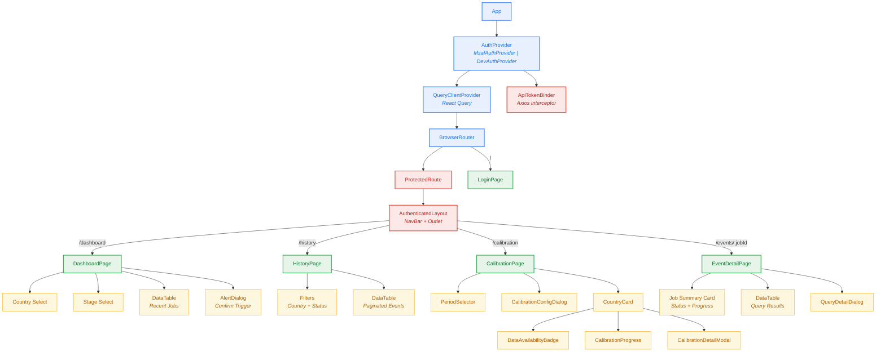
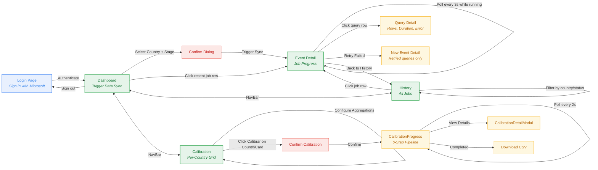
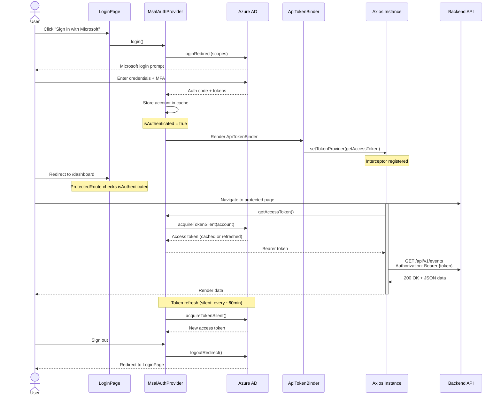
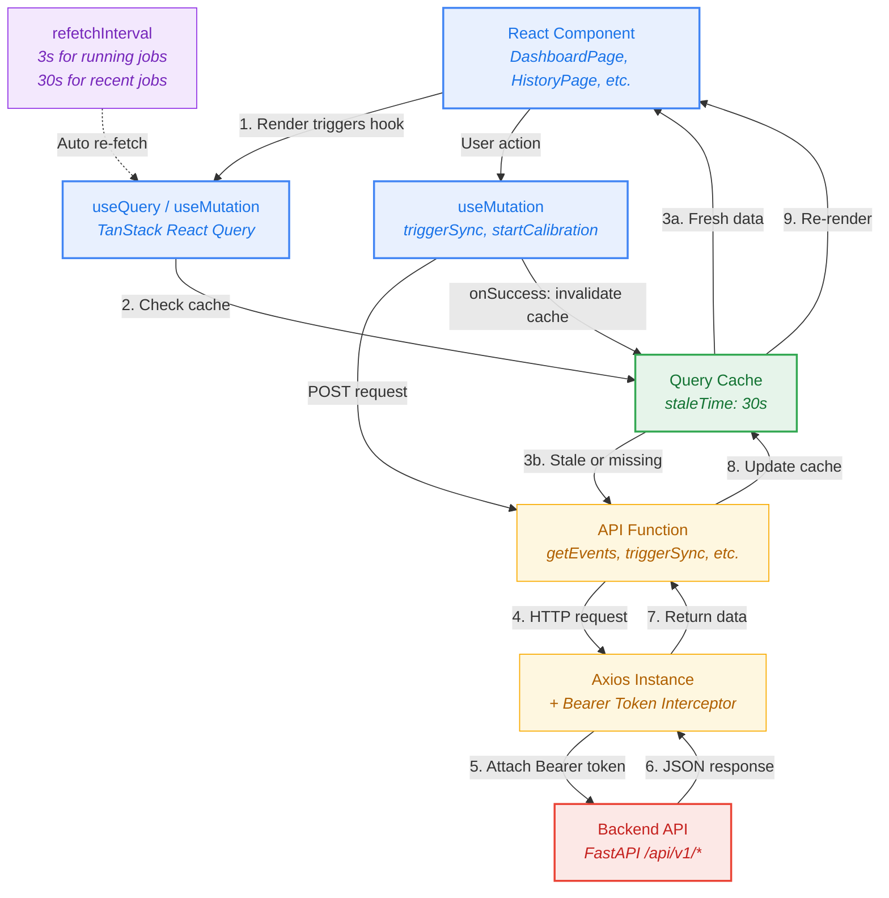
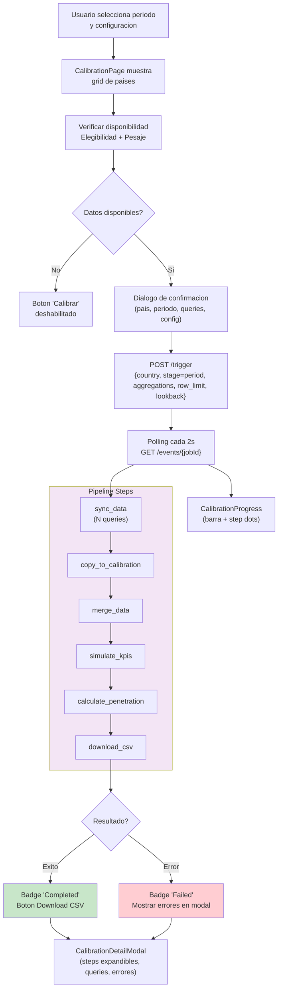

# SQL-Databricks Bridge -- Documentacion Frontend

## Tabla de Contenidos

- [Resumen Ejecutivo](#resumen-ejecutivo)
- [Tipo de Aplicacion](#tipo-de-aplicacion)
- [Stack Tecnologico](#stack-tecnologico)
- [Arquitectura de Componentes](#arquitectura-de-componentes)
  - [Jerarquia de Componentes](#jerarquia-de-componentes)
  - [Componentes Principales](#componentes-principales)
  - [Componentes de UI (Shadcn/ui)](#componentes-de-ui-shadcnui)
- [Paginas y Rutas](#paginas-y-rutas)
  - [Flujo de Navegacion del Usuario](#flujo-de-navegacion-del-usuario)
  - [LoginPage (/)](#loginpage-)
  - [DashboardPage (/dashboard)](#dashboardpage-dashboard)
  - [HistoryPage (/history)](#historypage-history)
  - [CalibrationPage (/calibration)](#calibrationpage-calibration)
  - [EventDetailPage (/events/:jobId)](#eventdetailpage-eventsjobid)
- [Autenticacion y Seguridad](#autenticacion-y-seguridad)
  - [Flujo de Autenticacion Azure AD](#flujo-de-autenticacion-azure-ad)
  - [Proveedores de Autenticacion](#proveedores-de-autenticacion)
  - [Proteccion de Rutas](#proteccion-de-rutas)
  - [Vinculacion de Tokens](#vinculacion-de-tokens)
- [Comunicacion con el Backend](#comunicacion-con-el-backend)
  - [Flujo de Datos con React Query](#flujo-de-datos-con-react-query)
  - [Configuracion de Axios](#configuracion-de-axios)
  - [Endpoints Consumidos](#endpoints-consumidos)
  - [Tipos de Datos (TypeScript)](#tipos-de-datos-typescript)
- [Hooks Personalizados](#hooks-personalizados)
- [Pipeline de Calibracion](#pipeline-de-calibracion)
  - [Flujo UI del Pipeline](#flujo-ui-del-pipeline)
  - [Etapas del Pipeline](#etapas-del-pipeline)
  - [Configuracion de Calibracion](#configuracion-de-calibracion)
- [Capa Nativa Tauri](#capa-nativa-tauri)
  - [Configuracion de Ventana](#configuracion-de-ventana)
  - [Comandos Rust](#comandos-rust)
  - [Plugins Tauri](#plugins-tauri)
- [Paises Soportados](#paises-soportados)
- [Configuracion del Entorno](#configuracion-del-entorno)
- [Flujo de Trabajo del Usuario](#flujo-de-trabajo-del-usuario)
  - [Caso 1: Sincronizacion de Datos](#caso-1-sincronizacion-de-datos)
  - [Caso 2: Calibracion de Pais](#caso-2-calibracion-de-pais)
  - [Caso 3: Revision de Historial](#caso-3-revision-de-historial)
- [Testing](#testing)
- [Build y Distribucion](#build-y-distribucion)

---

## Resumen Ejecutivo

SQL-Databricks Bridge es una **aplicacion de escritorio** desarrollada para Kantar Worldpanel LATAM que permite la sincronizacion bidireccional de datos entre SQL Server on-premise y Databricks Unity Catalog. La aplicacion proporciona una interfaz grafica para que los ingenieros de datos y analistas de Numerator/Kantar ejecuten y monitoreen trabajos de extraccion de datos y calibracion de paneles de consumidores para 8 paises de Latinoamerica. El frontend se comunica con un servicio backend FastAPI (ver [documentacion backend](backend-documentation.md)) que orquesta las operaciones de extraccion, sincronizacion y calibracion.

La aplicacion esta construida como un cliente de escritorio nativo usando Tauri 2.x, lo que permite su distribucion como instalable para Windows (NSIS). La autenticacion se realiza mediante Azure Active Directory (OAuth 2.0), garantizando que solo usuarios autorizados de la organizacion puedan acceder al sistema.

**Funcionalidades principales:**
- Disparar trabajos de sincronizacion SQL Server hacia Databricks por pais y etapa
- Monitorear en tiempo real el progreso de cada query individual dentro de un trabajo
- Ejecutar y supervisar pipelines de calibracion de panel multi-paso
- Revisar historial completo de trabajos con filtros y paginacion
- Reintentar queries fallidas de forma selectiva
- Descargar resultados en formato CSV

---

## Tipo de Aplicacion

**SQL-Databricks Bridge es una aplicacion de escritorio nativa**, NO una aplicacion web. Se distribuye como un ejecutable instalable para Windows.

| Caracteristica | Detalle |
|----------------|---------|
| Tipo | Aplicacion de escritorio nativa |
| Framework nativo | Tauri 2.x (Rust) |
| Motor de renderizado | WebView2 (Windows) |
| Distribucion Windows | Instalador NSIS (.exe) |
| Identificador | `com.kantar.sqldatabricksbridge` |
| Ventana | 1400x900 px (minimo 800x600 px) |

---

## Stack Tecnologico

| Capa | Tecnologia | Version |
|------|-----------|---------|
| UI Framework | React | 19.2.0 |
| Lenguaje | TypeScript | 5.9.3 |
| Bundler | Vite | 7.3.1 |
| Desktop Runtime | Tauri | 2.x |
| Lenguaje Nativo | Rust | 2021 edition |
| Estado del Servidor | TanStack React Query | 5.90 |
| Tablas | TanStack React Table | 8.21 |
| Estilos | Tailwind CSS | 4.1 |
| Componentes UI | Shadcn/ui + Radix UI | 1.4 |
| Iconos | Lucide React | 0.563 |
| Autenticacion | Azure MSAL Browser + MSAL React | 5.1 / 5.0 |
| HTTP Client | Axios | 1.13.5 |
| Notificaciones | Sonner | 2.0 |
| Routing | React Router DOM | 7.13 |
| Testing | Vitest + Testing Library + Playwright | 4.0 / 16.3 / 1.58 |

---

## Arquitectura de Componentes

### Jerarquia de Componentes



### Componentes Principales

| Componente | Archivo | Responsabilidad |
|-----------|---------|-----------------|
| `App` | `src/App.tsx` | Raiz de la aplicacion. Configura providers (Auth, QueryClient, Router) |
| `MsalAuthProvider` | `src/components/MsalAuthProvider.tsx` | Proveedor de autenticacion con Azure MSAL |
| `DevAuthProvider` | `src/components/DevAuthProvider.tsx` | Proveedor de autenticacion simulado para desarrollo local |
| `ProtectedRoute` | `src/components/ProtectedRoute.tsx` | Guard de rutas que redirige a `/` si no hay sesion |
| `AuthenticatedLayout` | `src/components/AuthenticatedLayout.tsx` | Layout con barra de navegacion, usuario y version |
| `ApiTokenBinder` | `src/components/ApiTokenBinder.tsx` | Vincula el token MSAL al interceptor de Axios (se ejecuta una sola vez) |
| `DataTable` | `src/components/DataTable.tsx` | Wrapper generico sobre TanStack Table con sorting y click en filas |
| `StatusBadge` | `src/components/StatusBadge.tsx` | Badge coloreado segun estado del job (pending, running, completed, failed, cancelled) |
| `CountryCard` | `src/components/CountryCard.tsx` | Tarjeta por pais con disponibilidad de datos, progreso y acciones de calibracion |
| `CalibrationProgress` | `src/components/CalibrationProgress.tsx` | Barra de progreso con indicadores por paso del pipeline |
| `CalibrationDetailModal` | `src/components/CalibrationDetailModal.tsx` | Modal con detalle de pipeline: pasos, queries, errores y descarga CSV |
| `CalibrationConfigDialog` | `src/components/CalibrationConfigDialog.tsx` | Dialogo de configuracion global de calibracion (agregaciones, limites) |
| `PeriodSelector` | `src/components/PeriodSelector.tsx` | Selector de periodo (ultimos 12 meses en formato YYYYMM) |
| `DataAvailabilityBadge` | `src/components/DataAvailabilityBadge.tsx` | Indicador visual de disponibilidad (elegibilidad/pesaje) |

### Componentes de UI (Shadcn/ui)

La aplicacion utiliza Shadcn/ui como sistema de componentes base, construido sobre Radix UI primitives. Los componentes se encuentran en `frontend/src/components/ui/`:

| Componente | Uso Principal |
|-----------|--------------|
| `Button` | Acciones primarias y secundarias |
| `Card` | Contenedores de informacion (Dashboard, Event Detail) |
| `Dialog` | Modales de detalle y configuracion |
| `AlertDialog` | Confirmaciones antes de acciones (trigger sync, calibracion) |
| `Select` | Selectores de pais, etapa, periodo, filtros |
| `Input` | Campos numericos (lookback months, row limit) |
| `Table` | Base para DataTable |
| `Badge` | Indicadores de estado |
| `Progress` | Barra de progreso de jobs |
| `Skeleton` | Placeholders durante carga |
| `Checkbox` | Opciones de agregacion en configuracion |
| `Separator` | Division visual entre secciones |

---

## Paginas y Rutas

### Flujo de Navegacion del Usuario



### LoginPage (/)

**Archivo:** `src/pages/LoginPage.tsx`

Pagina de inicio de sesion. Presenta una tarjeta centrada con el titulo de la aplicacion y un boton "Sign in with Microsoft". Si el usuario ya esta autenticado, redirige automaticamente a `/dashboard`.

**Comportamiento:**
- Muestra subtitulo: "Data sync operations for LATAM countries"
- Boton deshabilitado durante el proceso de login (`loading` state)
- Redireccion automatica via `<Navigate to="/dashboard" replace />` si `isAuthenticated === true`

### DashboardPage (/dashboard)

**Archivo:** `src/pages/DashboardPage.tsx`

Pagina principal tras autenticacion. Permite disparar trabajos de sincronizacion y ver los jobs mas recientes.

**Secciones:**
1. **Trigger Data Sync Card**: Formulario con tres campos:
   - Selector de pais (cargado desde `/metadata/countries`)
   - Selector de etapa (cargado desde `/metadata/stages`)
   - Campo numerico "Rolling Months" (default: 24)
   - Tag auto-generado: `{country}-{stage}-{YYYY-MM-DD}`
   - Boton "Trigger Sync" con dialogo de confirmacion

2. **Recent Jobs**: Tabla con las ultimas 5 ejecuciones (refresco cada 30 segundos). Columnas: Country, Tag, Status, Triggered By, When. Click en una fila navega a EventDetailPage.

### HistoryPage (/history)

**Archivo:** `src/pages/HistoryPage.tsx`

Listado completo de trabajos con filtros y paginacion server-side.

**Filtros:**
- Pais: 9 opciones (Argentina, Bolivia, Brazil, CAM, Chile, Colombia, Ecuador, Mexico, Peru)
- Estado: pending, running, completed, failed, cancelled

**Tabla:** Columnas: Country, Tag, Triggered By, Status, Queries (completadas/total), Date. Paginacion de 20 items por pagina con navegacion Previous/Next.

### CalibrationPage (/calibration)

**Archivo:** `src/pages/CalibrationPage.tsx`

Interfaz de calibracion organizada como grid de tarjetas por pais. Cada tarjeta (CountryCard) permite disparar y monitorear un pipeline de calibracion independiente.

**Elementos:**
- **PeriodSelector**: Selector de periodo (ultimos 12 meses)
- **CalibrationConfigDialog**: Configuracion global (agregaciones Region/Nivel 2, top limit, lookback months)
- **Grid de CountryCards**: Layout responsive (1-3 columnas segun ancho de pantalla)

Cada **CountryCard** muestra:
- Nombre del pais y cantidad de queries
- Estado de disponibilidad de datos (Elegibilidad y Pesaje)
- Barra de progreso con indicadores por paso del pipeline
- Boton "Calibrar" (requiere datos disponibles)
- Boton "Eye" para ver detalles en CalibrationDetailModal

### EventDetailPage (/events/:jobId)

**Archivo:** `src/pages/EventDetailPage.tsx`

Vista detallada de un trabajo de sincronizacion con monitoreo en tiempo real.

**Job Summary Card:**
- Estado, pais, etapa, tag, quien lo disparo
- Timestamps: inicio, fin, duracion
- Total de filas extraidas
- Barra de progreso con badges por estado (done, running, queued, failed)
- Lista de queries actualmente en ejecucion (animacion de spin)

**Query Results Table:** Columnas: Query Name, Status, Rows, Throughput (rows/s), Duration. Click en una fila abre QueryDetailDialog con informacion detallada (filas, duracion, tabla destino, errores).

**Funcionalidades especiales:**
- Polling automatico cada 3 segundos mientras el job esta `running` o `pending`
- Tick cada 1 segundo para actualizar duraciones en tiempo real
- Banner de advertencia para jobs con queries fallidas
- Boton "Retry N Failed" para reintentar solo las queries con error
- Deteccion automatica de timestamps UTC sin indicador de zona

---

## Autenticacion y Seguridad

### Flujo de Autenticacion Azure AD



### Proveedores de Autenticacion

La aplicacion implementa dos proveedores de autenticacion intercambiables:

**MsalAuthProvider** (produccion): Utiliza `@azure/msal-browser` y `@azure/msal-react` para autenticacion OAuth 2.0 con Azure Active Directory. Configurado con:
- Authority: `https://login.microsoftonline.com/{tenantId}`
- Scope: `api://{clientId}/access_as_user`
- Cache: `sessionStorage`
- Estrategia: `loginRedirect` (no popup)
- Renovacion silenciosa: `acquireTokenSilent` con fallback a `acquireTokenRedirect`

**DevAuthProvider** (desarrollo): Simula autenticacion para desarrollo local. Se activa con `VITE_AUTH_BYPASS=true`. Proporciona usuario ficticio `dev@localhost` y token `dev-bypass-token`.

La seleccion del proveedor se realiza en `App.tsx`:
```typescript
const AUTH_BYPASS = import.meta.env.VITE_AUTH_BYPASS === "true"
const AuthProvider = AUTH_BYPASS ? DevAuthProvider : MsalAuthProvider
```

### Proteccion de Rutas

`ProtectedRoute` actua como guardia de acceso para todas las rutas excepto `/`. Comportamiento:
- Si `loading === true`: muestra esqueleto de carga (Skeleton)
- Si `isAuthenticated === false`: redirige a `/` con `<Navigate to="/" replace />`
- Si `isAuthenticated === true`: renderiza las rutas hijas

### Vinculacion de Tokens

`ApiTokenBinder` es un componente invisible que vincula el proveedor de tokens al interceptor de Axios. Se ejecuta una unica vez cuando `isAuthenticated` cambia a `true`, utilizando una referencia (`useRef`) para evitar re-ejecuciones.

---

## Comunicacion con el Backend

### Flujo de Datos con React Query



**Configuracion de React Query:**
```typescript
const queryClient = new QueryClient({
  defaultOptions: {
    queries: {
      staleTime: 30_000,  // 30 segundos
      retry: 1,           // 1 reintento automatico
    },
  },
})
```

**Patrones de polling:**
- Recent jobs en Dashboard: `refetchInterval: 30_000` (cada 30 segundos)
- Event detail: `refetchInterval: 3_000` mientras status es `running` o `pending`, se detiene en estados finales
- Calibration job: `refetchInterval: 2_000` mientras esta activo
- Countries metadata: `staleTime: 5 * 60 * 1000` (5 minutos)
- Data availability: `staleTime: 60 * 1000` (1 minuto)

### Configuracion de Axios

**Archivo:** `src/lib/api.ts`

La instancia de Axios se configura con:
- **Base URL**: Determinada en orden de prioridad:
  1. `window.__BRIDGE_CONFIG__.API_URL` (config.json cargado por Tauri)
  2. `VITE_BRIDGE_API_URL` (variable de entorno)
  3. `http://localhost:8000/api/v1` (default)
- **Headers**: `Content-Type: application/json`
- **Interceptor de request**: Inyecta `Authorization: Bearer {token}` en cada peticion
- **Interceptor de response**: Transforma errores de Axios en formato `ApiError { error, message }`

### Endpoints Consumidos

| Metodo | Endpoint | Funcion TS | Uso |
|--------|----------|-----------|-----|
| `GET` | `/auth/me` | `getMe()` | Obtener perfil del usuario autenticado |
| `POST` | `/trigger` | `triggerSync(body)` | Disparar job de sincronizacion o calibracion |
| `GET` | `/events` | `getEvents(params?)` | Listar jobs con filtros y paginacion |
| `GET` | `/events/{jobId}` | `getEvent(jobId)` | Detalle de job con resultados por query |
| `GET` | `/events/{jobId}/download` | `downloadCSV(jobId)` | Descargar resultados en CSV |
| `GET` | `/metadata/countries` | `getCountries()` | Lista de paises con queries disponibles |
| `GET` | `/metadata/stages` | `getStages()` | Lista de etapas de sincronizacion |
| `GET` | `/metadata/data-availability` | `getDataAvailability(period)` | Disponibilidad de datos por pais y periodo |

### Tipos de Datos (TypeScript)

**Archivo:** `src/types/api.ts`

Tipos principales:

```typescript
type JobStatus = "pending" | "running" | "completed" | "failed" | "cancelled"

type CalibrationStepName =
  | "sync_data" | "copy_to_calibration" | "merge_data"
  | "simulate_kpis" | "calculate_penetration" | "download_csv"

interface TriggerRequest {
  country: string
  stage: string
  queries?: string[] | null
  lookback_months?: number | null
  row_limit?: number | null
  period?: string | null
  aggregations?: AggregationOptions
}

interface EventDetail extends EventSummary {
  results: QueryResult[]
}

interface EventSummary {
  job_id: string
  status: JobStatus
  country: string
  stage: string
  tag: string
  queries_total: number
  queries_completed: number
  queries_failed: number
  steps?: CalibrationStep[]
  current_step?: CalibrationStepName | null
  // ... mas campos
}
```

---

## Hooks Personalizados

| Hook | Archivo | Proposito |
|------|---------|-----------|
| `useAuth` | `src/hooks/useAuth.ts` | Contexto de autenticacion. Expone `isAuthenticated`, `user`, `loading`, `login()`, `logout()`, `getAccessToken()` |
| `useCalibration` | `src/hooks/useCalibration.ts` | Gestion de calibracion por pais. Combina `useMutation` (trigger) + `useQuery` (polling del job). Polling cada 2s hasta estado final |
| `useCountries` | `src/hooks/useCountries.ts` | Carga de metadatos de paises. Cache de 5 minutos |
| `useDataAvailability` | `src/hooks/useDataAvailability.ts` | Consulta disponibilidad de datos (elegibilidad y pesaje) por periodo. Cache de 1 minuto |

---

## Pipeline de Calibracion

### Flujo UI del Pipeline



Las 6 etapas del pipeline y sus indicadores visuales:

```mermaid
flowchart LR
    S1["sync_data<br/><b>Sync Data</b>"]
    S2["copy_to_calibration<br/><b>Copiar a Calibracion</b>"]
    S3["merge_data<br/><b>Fusionar Datos</b>"]
    S4["simulate_kpis<br/><b>Simular KPIs</b>"]
    S5["calculate_penetration<br/><b>Calcular Penetracion</b>"]
    S6["download_csv<br/><b>Descargar CSV</b>"]

    S1 ==> S2 ==> S3 ==> S4 ==> S5 ==> S6

    subgraph Legend["Iconos de Estado"]
        direction TB
        P["Pending -- circulo gris"]
        R["Running -- spinner azul"]
        C["Completed -- check verde"]
        F["Failed -- X roja"]
    end

    subgraph D1["Detalle Paso 1"]
        direction TB
        D1a["Extrae datos de SQL Server"]
        D1b["Sub-progreso: queries completadas / total"]
        D1c["Polling cada 2s mientras ejecuta"]
    end

    subgraph D6["Detalle Paso 6"]
        direction TB
        D6a["Genera CSV con resultados"]
        D6b["Descarga via Blob URL en el navegador"]
    end

    S1 -.-> D1
    S6 -.-> D6

    classDef pending fill:#f1f3f4,stroke:#9aa0a6,stroke-width:1px,color:#5f6368
    classDef running fill:#e8f0fe,stroke:#4285f4,stroke-width:2px,color:#1a73e8
    classDef completed fill:#e6f4ea,stroke:#34a853,stroke-width:2px,color:#137333
    classDef failed fill:#fce8e6,stroke:#ea4335,stroke-width:2px,color:#c5221f
    classDef step fill:#fff,stroke:#dadce0,stroke-width:2px,color:#202124
    classDef detail fill:#f8f9fa,stroke:#dadce0,stroke-width:1px,color:#5f6368

    class P pending
    class R running
    class C completed
    class F failed
    class S1,S2,S3,S4,S5,S6 step
    class D1,D6,D1a,D1b,D1c,D6a,D6b detail
```



### Etapas del Pipeline

El pipeline de calibracion consta de 6 etapas secuenciales:

| # | Paso | Nombre Interno | Descripcion |
|---|------|---------------|-------------|
| 1 | Sync Data | `sync_data` | Extraccion de datos de SQL Server. Muestra sub-progreso por query individual |
| 2 | Copy to Calibration | `copy_to_calibration` | Copia datos al esquema de calibracion en Databricks |
| 3 | Merge Data | `merge_data` | Fusion de tablas dimension y hechos |
| 4 | Simulate KPIs | `simulate_kpis` | Ejecucion de simuladores de KPI (kwp-simulators) |
| 5 | Calculate Penetration | `calculate_penetration` | Calculo de penetracion de mercado |
| 6 | Download CSV | `download_csv` | Generacion del archivo CSV de resultados |

La barra de progreso (`CalibrationProgress`) calcula el porcentaje combinando:
- Pasos completados como unidades enteras
- El paso `sync_data` como fraccion basada en queries completadas/total
- Indicadores visuales por paso: circulo gris (pending), spinner azul (running), check verde (completed), X roja (failed)

### Configuracion de Calibracion

El dialogo `CalibrationConfigDialog` permite ajustar parametros globales que aplican a todos los paises:

**Agregaciones:**
- Region (checkbox)
- Nivel 2 (checkbox)

**Overrides:**
- Top limit (numero de filas maximo, vacio = todas)
- Lookback months (meses de historico, default 13)

---

## Capa Nativa Tauri

### Configuracion de Ventana

Definida en `frontend/src-tauri/tauri.conf.json`:
- Titulo: "SQL Databricks Bridge"
- Dimensiones iniciales: 1400x900 pixeles
- Dimensiones minimas: 800x600 pixeles
- CSP: deshabilitado (null) para permitir comunicacion con API backend
- Modo de instalacion Windows: `currentUser` (no requiere privilegios de administrador)

### Comandos Rust

**`read_config`** (`src-tauri/src/lib.rs`): Comando Tauri que lee `config.json` desde el directorio del ejecutable. Permite configurar `API_URL` sin recompilar la aplicacion. Si el archivo no existe, retorna `{}`.

### Plugins Tauri

| Plugin | Proposito |
|--------|-----------|
| `tauri-plugin-opener` | Apertura de URLs externas |

---

## Paises Soportados

La aplicacion soporta 8 paises de LATAM:

| Codigo | Nombre | Etiqueta UI |
|--------|--------|-------------|
| `bolivia` | Bolivia | Bolivia |
| `brasil` | Brasil | Brasil |
| `cam` | Centroamerica | Centroamerica |
| `chile` | Chile | Chile |
| `colombia` | Colombia | Colombia |
| `ecuador` | Ecuador | Ecuador |
| `mexico` | Mexico | Mexico |
| `peru` | Peru | Peru |

Adicionalmente, `HistoryPage` incluye `argentina` y `brazil` en sus filtros para compatibilidad con datos historicos.

---

## Configuracion del Entorno

### Variables de Entorno (.env)

| Variable | Requerida | Descripcion | Ejemplo |
|----------|-----------|-------------|---------|
| `VITE_AZURE_AD_CLIENT_ID` | Si (produccion) | Client ID de la App Registration en Azure AD | `xxxxxxxx-xxxx-xxxx-xxxx-xxxxxxxxxxxx` |
| `VITE_AZURE_AD_TENANT_ID` | Si (produccion) | Tenant ID de Azure AD de Numerator | `xxxxxxxx-xxxx-xxxx-xxxx-xxxxxxxxxxxx` |
| `VITE_AZURE_AD_REDIRECT_URI` | No | URI de redireccion post-login. Default: `window.location.origin` | `http://localhost:5173` |
| `VITE_BRIDGE_API_URL` | No | URL base del backend API. Default: `http://localhost:8000/api/v1` | `http://127.0.0.1:8000/api/v1` |
| `VITE_AUTH_BYPASS` | No | Bypass de autenticacion para desarrollo. Default: `false` | `true` |

### Configuracion Externa (config.json)

Para despliegues de escritorio, la API URL puede configurarse mediante un archivo `config.json` ubicado junto al ejecutable:

```json
{
  "API_URL": "http://10.0.0.50:8000/api/v1"
}
```

La prioridad de resolucion es: `config.json` > `VITE_BRIDGE_API_URL` > default (`http://localhost:8000/api/v1`).

---

## Flujo de Trabajo del Usuario

### Caso 1: Sincronizacion de Datos

1. El usuario abre la aplicacion e inicia sesion con credenciales corporativas de Microsoft
2. En el **Dashboard**, selecciona un pais (ej: Chile) y una etapa (ej: bronze)
3. Opcionalmente ajusta los meses de rolling (default: 24)
4. Revisa el tag auto-generado (ej: `chile-bronze-2026-02-18`)
5. Hace click en "Trigger Sync" y confirma en el dialogo
6. La aplicacion navega automaticamente a la pagina de detalle del job
7. El progreso se actualiza en tiempo real: queries en ejecucion, completadas, filas extraidas
8. Al finalizar, puede ver metricas por query (throughput, duracion, tabla destino)
9. Si alguna query fallo, puede hacer click en "Retry N Failed" para reintentar solo las fallidas

### Caso 2: Calibracion de Pais

1. El usuario navega a la pagina **Calibration**
2. Selecciona el periodo deseado (ej: Feb 2026)
3. Opcionalmente ajusta configuracion global (agregaciones, limites) mediante el icono de engranaje
4. Revisa la disponibilidad de datos por pais (indicadores de Elegibilidad y Pesaje)
5. En la tarjeta del pais deseado, hace click en "Calibrar" y confirma
6. La barra de progreso muestra el avance del pipeline de 6 pasos
7. Los indicadores de paso (dots) se actualizan en tiempo real
8. Al completar, puede hacer click en el icono de ojo para ver detalles expandibles
9. Desde el modal de detalle puede descargar el CSV con resultados

### Caso 3: Revision de Historial

1. El usuario navega a la pagina **History**
2. Aplica filtros por pais y/o estado segun necesidad
3. Navega entre paginas si hay mas de 20 resultados
4. Hace click en cualquier fila para ver el detalle completo del job
5. Desde el detalle puede reintentar queries fallidas o revisar errores

---

## Testing

La aplicacion incluye tests unitarios con Vitest y Testing Library, ubicados en `frontend/src/__tests__/`:

| Test | Archivo | Cobertura |
|------|---------|-----------|
| LoginPage | `LoginPage.test.tsx` | Renderizado, boton de login, redireccion si autenticado |
| DashboardPage | `DashboardPage.test.tsx` | Formulario de trigger, tabla de jobs recientes |
| HistoryPage | `HistoryPage.test.tsx` | Filtros, paginacion, navegacion a detalle |
| EventDetail | `EventDetail.test.tsx` | Detalle de job, tabla de queries, retry |

**Ejecucion:**
```bash
cd frontend
npm run test        # Vitest run (single pass)
npm run test:watch  # Vitest watch mode
```

Para tests end-to-end, la aplicacion esta preparada con Playwright (`@playwright/test`).

---

## Build y Distribucion

### Desarrollo Local

```bash
cd frontend
npm install
npm run dev          # Vite dev server (http://localhost:5173)
npm run tauri:dev    # Tauri dev mode (ventana nativa + hot reload)
```

### Build de Produccion

```bash
cd frontend
npm run build        # Build web (TypeScript + Vite)
npm run tauri:build  # Build desktop (genera instaladores)
```

**Artefactos generados:**
- **Windows:** `frontend/src-tauri/target/release/bundle/nsis/SQL Databricks Bridge_{version}_x64-setup.exe`

### Distribucion

El instalador de Windows usa modo `currentUser`, lo que significa que no se requieren privilegios de administrador para la instalacion. Los ejecutables se publican como releases en GitHub.
