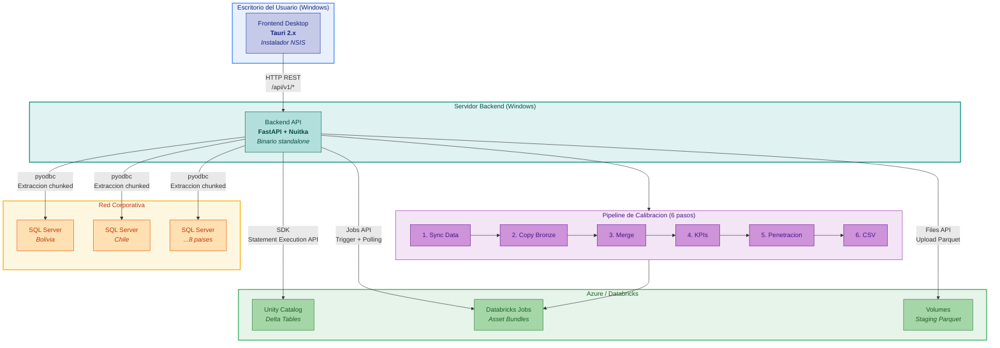

# SQL-Databricks Bridge -- Resumen Ejecutivo

**Servicio**: sql-databricks-bridge v0.1.14
**Equipo**: Technology Solutions LATAM -- Numerator / Kantar
**Fecha**: Febrero 2026

---

## Descripcion General

SQL-Databricks Bridge es un sistema de escritorio compuesto por dos ejecutables independientes que trabajan en conjunto para sincronizar datos entre SQL Server on-premise y Databricks Unity Catalog, y orquestar pipelines de calibracion de panel de consumidores para 8 paises de Latinoamerica (Bolivia, Brasil, CAM, Chile, Colombia, Ecuador, Mexico, Peru).

| Componente | Tipo | Tecnologia | Ejecutable |
|-----------|------|-----------|------------|
| **Frontend** | Aplicacion de escritorio nativa | Tauri 2.x (Rust + React 19 + TypeScript) | Instalador NSIS para Windows (.exe) |
| **Backend** | Servicio API standalone | FastAPI (Python 3.11) compilado con Nuitka | Binario Windows sin dependencia de Python |

Ambos componentes se distribuyen como ejecutables standalone para Windows. No requieren instalacion de runtimes adicionales (ni Node.js, ni Python). El frontend se comunica con el backend via HTTP REST (`/api/v1`).

---

## Funcionalidades

| Funcionalidad | Descripcion |
|--------------|-------------|
| **Sincronizacion SQL Server -> Databricks** | Extraccion paralela de tablas por pais hacia Delta tables en Unity Catalog, con chunking configurable y versionamiento automatico |
| **Calibracion de Panel** | Pipeline de 6 pasos (sync, copy, merge, simulate KPIs, penetracion, CSV) orquestado sobre Databricks Asset Bundles con monitoreo en tiempo real |
| **Monitoreo de Jobs** | Progreso en tiempo real por query individual, tiempos, throughput y deteccion de errores |
| **Historial y Filtros** | Registro completo de ejecuciones con filtros por pais, estado y paginacion server-side |
| **Retry Selectivo** | Reintento individual de queries fallidas sin re-ejecutar el job completo |
| **Descarga de Resultados** | Exportacion CSV de resultados de calibracion |

---

## Diagrama General del Sistema



---

## Flujo Tipico de Uso

```
1. INICIO
   El usuario abre la aplicacion de escritorio e ingresa al sistema.

2. SINCRONIZACION DE DATOS
   En el Dashboard, selecciona un pais y una etapa (ej: Chile - Calibracion).
   Confirma el trigger. La aplicacion navega al detalle del job donde se
   muestra el progreso en tiempo real: queries ejecutandose, filas extraidas,
   throughput por query.

3. CALIBRACION
   En la pagina de Calibracion, selecciona el periodo (ej: Feb 2026),
   verifica disponibilidad de datos (elegibilidad y pesaje) por pais,
   y lanza el pipeline de 6 pasos. La barra de progreso y los indicadores
   por paso se actualizan automaticamente cada 2 segundos.

4. REVISION Y DESCARGA
   Al completar, revisa el detalle expandible de cada paso y descarga
   el CSV con los resultados. Si alguna query fallo, puede reintentar
   solo las fallidas sin re-ejecutar todo el job.

5. HISTORIAL
   En cualquier momento, consulta el historial completo de ejecuciones
   con filtros por pais y estado, y navega al detalle de cualquier job.
```

---

## Stack Tecnologico

| Capa | Frontend | Backend |
|------|----------|---------|
| **Lenguaje** | TypeScript 5.9 + Rust | Python 3.11 |
| **Framework** | React 19 + Tauri 2.x | FastAPI |
| **Estado** | TanStack React Query | In-memory + SQLite |
| **DataFrames** | -- | Polars |
| **Base de datos** | -- | SQL Server (pyodbc), Databricks SDK, SQLite |
| **UI** | Tailwind CSS + Shadcn/ui | -- |
| **Compilacion** | Tauri Build (NSIS) | Nuitka (standalone) |
| **Distribucion** | Instalador .exe Windows | Binario .exe Windows |
