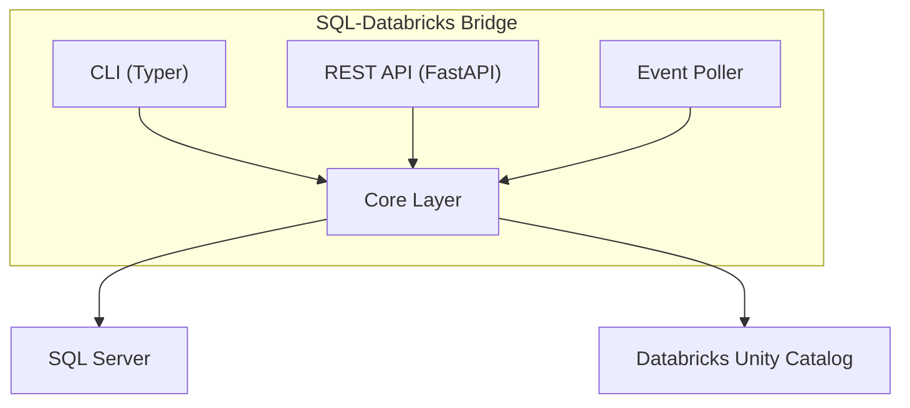
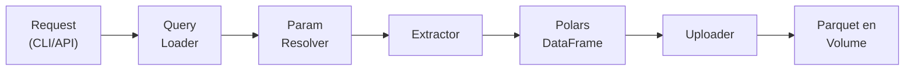
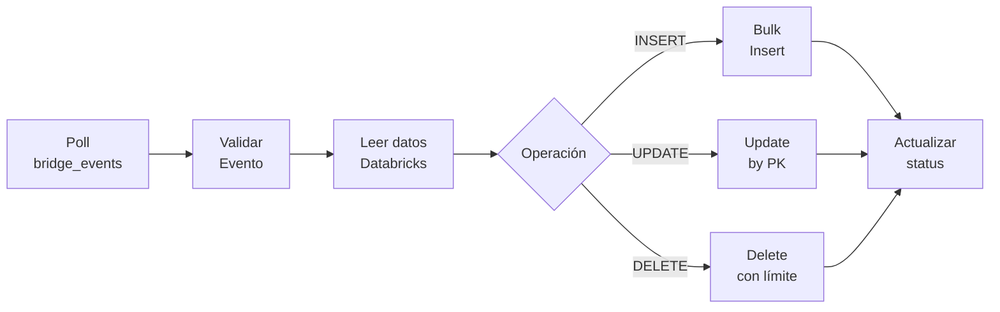
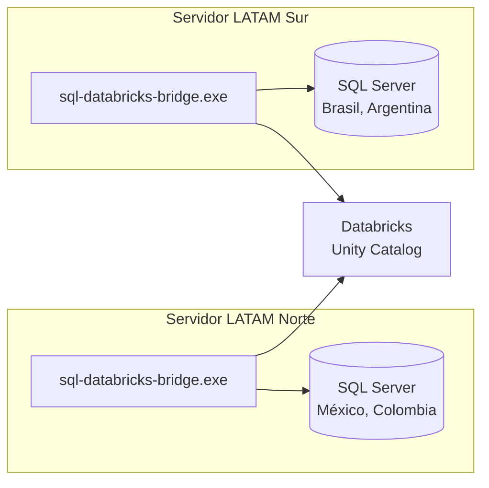

# SQL-Databricks Bridge

Sincronización bidireccional de datos entre SQL Server y Databricks

<div class="pt-12">
  <span class="px-2 py-1 rounded cursor-pointer" hover="bg-white bg-opacity-10">
    Kantar Worldpanel - Data Engineering
  </span>
</div>

---

# Agenda

- Problema y solución
- Arquitectura del sistema
- Flujos de datos
- CLI y API
- **SDKs: API Local y Databricks Jobs**
- Configuración
- Seguridad y permisos
- Demo

---
layout: center
---

# El Problema

---

# Desafíos de Integración

<v-clicks>

- **Datos dispersos**: SQL Server on-premise + Databricks en la nube
- **Sincronización manual**: Scripts ad-hoc, propensos a errores
- **Sin trazabilidad**: No hay auditoría de qué datos se movieron
- **Permisos inconsistentes**: Cada proyecto maneja su propia autenticación

</v-clicks>

---
layout: center
---

# La Solución

---

# SQL-Databricks Bridge

<v-clicks>

- **Extracción**: SQL Server → Databricks (Parquet en Volumes)
- **Sincronización**: Databricks → SQL Server (INSERT/UPDATE/DELETE)
- **CLI + API**: Flexibilidad para automatización y uso interactivo
- **Seguridad**: Tokens por proyecto, permisos por tabla, auditoría

</v-clicks>

---
layout: center
---

# Arquitectura

---

# Vista General del Sistema



---

# Estructura de Módulos

```
src/sql_databricks_bridge/
├── api/           # REST API (FastAPI)
│   ├── routes/    # Endpoints
│   └── schemas.py # Modelos Pydantic
├── cli/           # Comandos CLI (Typer)
├── core/          # Lógica de negocio
│   ├── extractor.py
│   └── uploader.py
├── sync/          # Sincronización inversa
│   ├── poller.py
│   └── operations.py
├── auth/          # Autenticación
└── db/            # Clientes de BD
```

---
layout: center
---

# Flujo de Extracción

---

# SQL Server → Databricks



---

# Queries Parametrizadas

```sql
-- queries/extract_ventas.sql
SELECT
    id_transaccion,
    fecha,
    {factor} as factor_expansion,
    monto_total
FROM {database}.{schema}.{sales_table}
WHERE pais = '{country_code}'
  AND fecha >= '{start_date}'
```

<v-click>

```yaml
# config/common_params.yaml
factor: factor_rw1 as factor_rw
start_date: "2024-01-01"

# config/Colombia.yaml
country_code: CO
database: KWP_Colombia
sales_table: J_Ventas_CO
```

</v-click>

---
layout: center
---

# Flujo de Sincronización

---

# Databricks → SQL Server



---

# Tabla de Eventos

```sql
INSERT INTO bridge.events.bridge_events (
  event_id,
  operation,
  source_table,
  target_table,
  primary_keys
) VALUES (
  uuid(),
  'INSERT',
  'catalog.schema.source',
  'dbo.target',
  array('id')
);
```

<v-click>

El poller procesa eventos cada **10 segundos**

</v-click>

---
layout: center
---

# CLI

---

# Comandos Disponibles

| Comando | Descripción |
|---------|-------------|
| `extract` | Extraer datos de SQL Server a Databricks |
| `list-queries` | Listar archivos SQL disponibles |
| `show-params` | Mostrar parámetros resueltos |
| `test-connection` | Probar conectividad |
| `serve` | Iniciar servidor API |

---

# Ejemplo de Extracción

```bash
sql-databricks-bridge extract \
  --queries-path ./queries \
  --config-path ./config \
  --country Colombia \
  --destination /Volumes/catalog/schema/volume
```

<v-click>

```bash
# Extraer queries específicos
sql-databricks-bridge extract \
  --queries-path ./queries \
  --config-path ./config \
  --country Mexico \
  --query ventas \
  --query productos \
  --overwrite
```

</v-click>

---
layout: center
---

# REST API

---

# Endpoints Principales

| Método | Endpoint | Descripción |
|--------|----------|-------------|
| POST | `/extract` | Iniciar extracción |
| GET | `/jobs/{id}` | Estado del job |
| GET | `/jobs` | Listar jobs |
| DELETE | `/jobs/{id}` | Cancelar job |
| GET | `/health/live` | Liveness probe |
| GET | `/health/ready` | Readiness probe |

---

# Ejemplo de API

```bash
# Iniciar extracción
curl -X POST http://localhost:8000/extract \
  -H "Authorization: Bearer your-token" \
  -H "Content-Type: application/json" \
  -d '{
    "queries_path": "./queries",
    "config_path": "./config",
    "country": "Colombia",
    "destination": "/Volumes/catalog/schema/vol"
  }'
```

<v-click>

```bash
# Verificar estado
curl http://localhost:8000/jobs/{job_id} \
  -H "Authorization: Bearer your-token"
```

</v-click>

---
layout: center
---

# SDKs

---

# Modos de Uso del SDK

| Modo | Descripción | Caso de Uso |
|------|-------------|-------------|
| **API Local** | Cliente Python para consumir la REST API | Apps locales, servicios externos |
| **Databricks Jobs** | Uso directo de la librería en notebooks/jobs | Pipelines en Databricks |

<v-click>

```
sql-databricks-bridge
├── sdk/              # SDKs para consumidores
│   ├── client.py     # Cliente REST API
│   └── databricks.py # Helpers para jobs
└── ...
```

</v-click>

---

# SDK: Cliente API Local

Para aplicaciones que consumen la API REST desde Python:

```python
from sql_databricks_bridge.sdk import BridgeClient

# Inicializar cliente
client = BridgeClient(
    base_url="http://localhost:8000",
    token="your-api-token"
)

# Extraer datos de SQL Server a Databricks
job = client.extract(
    queries_path="./queries",
    config_path="./config",
    country="Colombia",
    destination="/Volumes/catalog/schema/volume"
)

# Verificar estado
status = client.get_job_status(job.job_id)
print(f"Estado: {status.state}")
```

---

# SDK: Cliente API - Sync Events

```python
from sql_databricks_bridge.sdk import BridgeClient

client = BridgeClient(base_url="http://localhost:8000", token="token")

# Enviar evento de sincronización (Databricks → SQL Server)
event = client.submit_sync_event(
    operation="INSERT",
    source_table="catalog.schema.source_table",
    target_table="dbo.target_table",
    primary_keys=["id"]
)

# Monitorear estado del evento
status = client.get_sync_event(event.event_id)
print(f"Estado: {status.status}, Filas: {status.rows_affected}")
```

<v-click>

```python
# Listar eventos con filtros
events = client.list_sync_events(status="failed", limit=10)
for e in events:
    print(f"{e.event_id}: {e.error_message}")
```

</v-click>

---

# SDK: Databricks Jobs

Para scripts que corren directamente en Databricks Jobs/Notebooks:

```python
# En un notebook de Databricks
from sql_databricks_bridge.sdk.databricks import BridgeOperator

# Inicializar operador (usa credenciales del job context)
operator = BridgeOperator(
    sql_server_host="server.database.windows.net",
    sql_server_database="KWP_Colombia",
    sql_server_user=dbutils.secrets.get("scope", "sql_user"),
    sql_server_password=dbutils.secrets.get("scope", "sql_pass")
)

# Sincronizar datos desde tabla Databricks a SQL Server
result = operator.sync_to_sql_server(
    source_table="catalog.schema.calibrated_panel",
    target_table="dbo.CalibrationResults",
    operation="INSERT",
    primary_keys=["id_hogar", "periodo"]
)

print(f"Filas sincronizadas: {result.rows_affected}")
```

---

# SDK: Databricks Jobs - Extracción

```python
from sql_databricks_bridge.sdk.databricks import BridgeOperator

operator = BridgeOperator(
    sql_server_host="server.database.windows.net",
    sql_server_database="KWP_Colombia",
    sql_server_user=dbutils.secrets.get("scope", "sql_user"),
    sql_server_password=dbutils.secrets.get("scope", "sql_pass")
)

# Extraer de SQL Server a DataFrame de Spark
df = operator.extract_to_spark(
    query="""
        SELECT id_transaccion, fecha, monto_total
        FROM dbo.Ventas
        WHERE fecha >= '2024-01-01'
    """
)

# Guardar como tabla Delta
df.write.format("delta").saveAsTable("catalog.schema.ventas_extract")
```

---

# SDK: Instalación

```bash
# Desde PyPI (producción)
pip install sql-databricks-bridge

# Para desarrollo local
pip install -e ".[dev]"

# En Databricks (requirements.txt del job)
sql-databricks-bridge>=1.0.0
```

<v-click>

**Configuración en Databricks Job:**

```yaml
# databricks.yml (asset bundle)
resources:
  jobs:
    sync_job:
      tasks:
        - task_key: sync_to_sql
          python_wheel_task:
            package_name: sql_databricks_bridge
          libraries:
            - pypi:
                package: sql-databricks-bridge
```

</v-click>

---
layout: two-cols
---

# SDK: Comparación

**API Local (BridgeClient)**

- Consume REST API
- Requiere servidor corriendo
- Para apps externas
- Autenticación por token

```python
client = BridgeClient(
    base_url="http://...",
    token="..."
)
client.extract(...)
```

::right::

**Databricks Jobs (BridgeOperator)**

- Uso directo de la librería
- No requiere servidor
- Para notebooks/jobs
- Credentials de SQL Server

```python
operator = BridgeOperator(
    sql_server_host="...",
    sql_server_password="..."
)
operator.sync_to_sql_server(...)
```

---
layout: center
---

# Seguridad

---
layout: two-cols
---

# Autenticación

```yaml
# config/permissions.yaml
users:
  - token: "proyecto-abc-token"
    name: "proyecto-abc"
    permissions:
      - table: "dbo.Ventas"
        access: "read_write"
        max_delete_rows: 10000
```

::right::

# Niveles de Acceso

| Nivel | Read | Write | Delete |
|-------|:----:|:-----:|:------:|
| `read` | ✓ | ✗ | ✗ |
| `write` | ✗ | ✓ | ✓* |
| `read_write` | ✓ | ✓ | ✓* |

<v-click>

\* DELETE limitado por `max_delete_rows`

</v-click>

---

# Auditoría

Todos los eventos de seguridad se registran:

```json
{
  "timestamp": "2024-01-15T10:30:00Z",
  "event_type": "auth_success",
  "user_name": "proyecto-abc",
  "source_ip": "10.0.0.1",
  "resource": "dbo.Ventas",
  "action": "read"
}
```

---
layout: center
---

# Configuración

---

# Variables de Entorno

```bash
# SQL Server
SQLSERVER_HOST=your-server.database.windows.net
SQLSERVER_DATABASE=your_database
SQLSERVER_USERNAME=your_user
SQLSERVER_PASSWORD=your_password

# Databricks (solo conexión, catálogo va en --destination)
DATABRICKS_HOST=https://workspace.azuredatabricks.net
DATABRICKS_TOKEN=your_token
```

<v-click>

> El catálogo se especifica en el path de destino:
> `--destination /Volumes/{catalog}/{schema}/{volume}`

</v-click>

---

# Retry y Tolerancia a Fallos

<v-clicks>

- **Máximo intentos**: 3
- **Backoff**: Exponencial con jitter
- **Delay base**: 1 segundo
- **Delay máximo**: 60 segundos
- **Discrepancias**: Se reportan pero no bloquean

</v-clicks>

---
layout: center
---

# Deployment

---

# Compilación con Nuitka

```powershell
# Compilar ejecutable standalone para Windows
nuitka --standalone --onefile `
  --include-data-dir=config=config `
  --output-filename=sql-databricks-bridge.exe `
  src/sql_databricks_bridge/cli/commands.py

# Resultado: ejecutable único ~50MB
# No requiere Python instalado en servidor destino
```

<v-click>

```powershell
# Verificar ejecutable
.\sql-databricks-bridge.exe --version
.\sql-databricks-bridge.exe test-connection
```

</v-click>

---

# Arquitectura de Deployment



---

# Servicio Windows (NSSM)

```powershell
# Descargar NSSM desde nssm.cc
# Instalar como servicio Windows

nssm install SQLDatabricksBridge `
  C:\Bridge\sql-databricks-bridge.exe serve

nssm set SQLDatabricksBridge AppDirectory C:\Bridge
nssm set SQLDatabricksBridge AppEnvironmentExtra `
  "SQLSERVER_HOST=server.database.windows.net" `
  "DATABRICKS_HOST=https://workspace.azuredatabricks.net"
```

<v-click>

> NSSM reinicia automáticamente el servicio si falla

</v-click>

---

# Gestión del Servicio

```powershell
# Iniciar servicio
nssm start SQLDatabricksBridge

# Detener servicio
nssm stop SQLDatabricksBridge

# Ver estado
nssm status SQLDatabricksBridge
```

<v-click>

```powershell
# También disponible en Services (services.msc)
# O con PowerShell nativo:
Get-Service SQLDatabricksBridge
Start-Service SQLDatabricksBridge
```

</v-click>

---
layout: center
---

# Resumen

---

# Beneficios Clave

<v-clicks>

- **Bidireccional**: SQL ↔ Databricks en ambas direcciones
- **Flexible**: CLI para scripts, API para automatización
- **Seguro**: Tokens, permisos por tabla, auditoría
- **Robusto**: Retry automático, tolerancia a fallos
- **Observable**: Health checks, logging estructurado

</v-clicks>

---
layout: center
class: text-center
---

# Gracias

[Documentación](./docs/) · [Azure DevOps](https://kantarware.visualstudio.com/KWP-TechnologySolutionsLATAM/_git/sql-databricks-bridge)

<div class="pt-12">
  <span class="px-2 py-1 rounded cursor-pointer" hover="bg-white bg-opacity-10">
    ¿Preguntas?
  </span>
</div>
